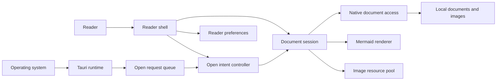

# open.md architecture context

This document names the stable domain boundaries behind the desktop reader.
`src/main.js` remains the composition root; it wires DOM and Tauri adapters to
modules that own lifecycle and policy.

## System context

## Bounded responsibilities

### Reader shell

- Public composition seam: `mountReaderShell({ window, adapters, hooks })`.
- Creates and disposes one document session, open-intent controller, and
  preference owner.
- Exposes document opening, appearance refresh, current document state, and
  preferences without exposing internal request generations or queues.

### Document session

- Owns one document's open, stale-result cancellation, render, enrichment,
  focus, relative-image resources, replacement, and disposal lifecycle.
- Accepts native document/image, Mermaid, clipboard, and Blob-resource
  adapters.
- Invariant: only the current generation may change the rendered document or
  retain resources.

### Native document access

- Owns canonical file access, supported document and image policy, byte
  limits, UTF-8 validation, Markdown/plain-text rendering, metadata, and image
  containment.
- Returns the current structured document payload only; there is no welcome or
  legacy string payload.
- `src-tauri/src/lib.rs` and `images.rs` are Tauri adapters, not policy
  owners.

### Document resource

- A relative image requested by the current document.
- Rust proves it remains inside the document directory and meets type and size
  policy before returning bytes.
- The frontend owns Blob URL creation, the 64 MiB per-document budget, and
  deterministic revocation.

### Open intent

- Canonical request with `origin`, document `items`, and optional delivery
  acknowledgment.
- Origins are launch, operating-system association, picker, drop, and document
  link.
- The controller owns path normalization, per-intent deduplication, supported
  type feedback, readiness, order, duplicate native delivery, and current/new
  window policy.
- Native requests remain listed until acknowledged while the native process is
  alive. One webview coordinates delivery; pending IDs move to another reader
  window if that coordinator closes. See
  [ADR 0001](docs/adr/0001-open-intent-delivery.md).

### Reader preferences

- Owns current schemas, defaults, normalization, persistence, notifications,
  and native always-on-top recovery.
- Supports Web Storage in production and an in-memory store in tests or when
  storage is unavailable.
- Invariant: a failed native pin operation cannot leave the model or persisted
  value claiming that the window is pinned.

## Cross-boundary rules

- The frontend never reads local files directly; Tauri document access is the
  authority for filesystem safety.
- Local picker, drop, and document-link intents replace the current document.
  Operating-system association intents preserve an occupied document and open
  another window.
- Event and pending-list delivery may repeat the same native request; its
  stable ID makes processing idempotent within the active shell.
- The open-request queue is in memory. It covers readiness, reload, and live
  window handoff, not replay after a full process crash.
- Unsupported paths reach the open-intent controller so every ingress uses the
  same user feedback.
- Reader preferences may continue in volatile memory after a storage failure;
  native window state remains pessimistic.

## Verification map

- Shell composition: `src/reader-shell.test.js`
- Document lifecycle: `src/document-session.test.js`
- Open policy: `src/open-intent-controller.test.js` and Rust queue tests
- Preferences: `src/reader-preferences.test.js`
- Filesystem and rendering policy: Rust tests in
  `src-tauri/src/document_access.rs`
- Static repository contracts: `scripts/validate-frontend.mjs`

The accepted implementation record is
[the architecture workplan](docs/architecture/WORKPLAN.md).
