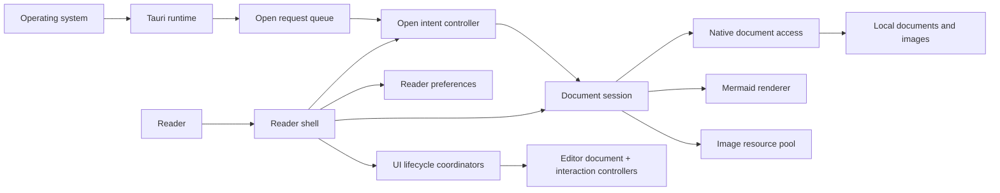

# open.md architecture context

This document names the stable domain boundaries behind the desktop reader.
`src/main.js` remains the composition root; it wires DOM and Tauri adapters to
modules that own lifecycle and policy.

## System context

## Bounded responsibilities

### Reader shell

- Public composition seam: `mountReaderShell({ window, adapters, hooks })`.
- Creates and disposes one document session, open-intent controller, and
  preference owner.
- Exposes document opening, appearance refresh, current document state, and
  preferences without exposing internal request generations or queues.

### Document session

- Owns one document's open, stale-result cancellation, render, enrichment,
  focus, relative-image resources, replacement, and disposal lifecycle.
- Accepts native document/image, Mermaid, clipboard, and Blob-resource
  adapters.
- Invariant: only the current generation may change the rendered document or
  retain resources.

### Native document access

- Owns canonical file access, supported document and image policy, byte
  limits, UTF-8 validation, Markdown/plain-text rendering, metadata, and image
  containment.
- Returns the current structured document payload only; there is no welcome or
  legacy string payload.
- `src-tauri/src/lib.rs` and `images.rs` are Tauri adapters, not policy
  owners.

### Document resource

- A relative image requested by the current document.
- Rust proves it remains inside the document directory and meets type and size
  policy before returning bytes.
- The frontend owns Blob URL creation, the 64 MiB per-document budget, and
  deterministic revocation.

### Open intent

- Canonical request with `origin`, document `items`, and optional delivery
  acknowledgment.
- Origins are launch, operating-system association, picker, drop, and document
  link.
- The controller owns path normalization, per-intent deduplication, supported
  type feedback, readiness, order, duplicate native delivery, and current/new
  window policy.
- Native requests remain listed until acknowledged while the native process is
  alive. One webview coordinates delivery; pending IDs move to another reader
  window if that coordinator closes. See
  [ADR 0001](docs/adr/0001-open-intent-delivery.md).

### Reader preferences

- Owns current schemas, defaults, normalization, persistence, notifications,
  and native always-on-top recovery.
- Supports Web Storage in production and an in-memory store in tests or when
  storage is unavailable.
- Invariant: a failed native pin operation cannot leave the model or persisted
  value claiming that the window is pinned.

### App runtime settings (native)

- Owns process-level policy that must be known before the webview loads:
  multi-instance vs single-instance boot (`settings.json` under the app config
  directory).
- `src-tauri/src/app_settings.rs` is the owner; `lib.rs` applies the choice by
  registering `tauri-plugin-single-instance` only when multi-instance is off.
- File-association **actions** live in `src-tauri/src/file_associations.rs`
  (OS UI / user-scoped defaults). They are not reader preferences and do not
  claim silent default-app ownership.
- Frontend Advanced → System projects these via runtime adapters; disk truth
  wins over HTML defaults after hydrate.

### UI lifecycle coordinators

- `src/main.js` remains the composition root. It declares acquisitions, event
  bindings, and concrete DOM/native adapters; it does not own their private
  state or listener queues.
- `src/application-lifecycle.js` owns each disposable at its acquisition site,
  plus startup failure cleanup, beforeunload guarding, event binding, and
  idempotent reverse teardown. No parallel disposal ledger is allowed.
- `src/application-runtime-adapters.js` owns native/preview document access,
  save, image bytes, syntax loading, Mermaid adapters, storage, and window
  pinning behind the existing shell adapter shape.
- `src/document-ingress-controller.js` owns picker, native association replay,
  drag safety, native drop, dirty-document guards, and ingress teardown.
- `src/document-view-state.js` owns the current path/document identity and
  loading, ready, failed, idle, replacement, same-path save projection, and
  save fan-out.
- `src/reader-viewport-controller.js` owns empty/content/source/help
  projection, inert/ARIA state, help focus, page state, body state, and scroll
  reset.
- `src/reader-controls.js` owns preference-to-control projection, panel/focus
  rules, reading-tool state, fonts, auto-save, and always-on-top actions.
- `src/reader-zoom-controller.js` owns content zoom scale, wheel gesture
  policy, CSS scale publishing, and zoom toast feedback.
- `src/status-presenter.js` owns identity text and document/editor metric
  composition (not only DOM metric rendering).
- `src/reading-navigation-controller.js`, `src/document-mode-coordinator.js`,
  `src/toast-presenter.js`, and `src/editor-feedback-presenter.js` own their
  visual lifecycle and disposal.
- Each module owns its timers, listeners, transition/RAF state and disposal;
  the composition root does not coordinate their private revisions or queues.
- A Read/Edit/Source transition is scoped to the document identity captured at
  its start and restores that document's exact reader scroll position.
- Invariant: replacement or disposal invalidates stale visual and save work
  before it can commit back into the current document.
- Invariant: theme selection, public state and persistence advance only after
  diagram preparation and the visual token commit succeed together.

### Editor document and interactions

- `src/editor-document.js` owns canonical blocks, Markdown/TXT serialization,
  cursor snapshots, bounded history, CRUD, split/merge and reorder operations.
- `src/editor-session.js` renders model snapshots and composes dedicated
  overlay, selection, and block-interaction controllers.
- Overlay, selection and block controllers own their document listeners,
  transient state, keyboard/focus rules, animation handles and disposal.
- The editor session owns and removes its canvas input, keyboard, click, and
  change listeners; initial edit focus uses `preventScroll`.
- Invariant: the DOM is a projection of the editor model; it does not own an
  independent block or undo/redo history.
- Cursor-only updates reuse the frozen source/block/stat projection; moving the
  caret cannot serialize or clone the full document.

### Document format authority

- `src/format-detect.js` owns frontend path support, extension tables, magic
  reclassification heuristics, and image MIME ids. Native open remains
  authoritative for filesystem acceptance.
- `src/format-registry.js` owns format capabilities: allowed modes, editor
  kind, read renderer, highlight language, display labels, status profiles,
  `resolveFormatId`, companion-text detection, and soft reading-tool patches
  for companion formats.
- `src/format-readers.js` owns pure rich-Read HTML for companion formats.
- `src/status-metrics.js` owns pure status metric composition by status
  profile (markdown, text, json, csv, image).
- `src/json-property-model.js` / `src/json-property-editor.js` own minimal
  JSON property edit (parse/rows/serialize and DOM projection). Markdown
  block serialization must not rewrite JSON.
- Mode availability uses `allowsDocumentMode`; composition root does not keep
  parallel image format lists.
- Invariant: payload `format`/`kind` win over path hints when both are present.

### Document path, payload, and source domains

- `src/document-path.js` owns display names, relative path resolution, link
  action classification, and relative image source policy.
- `src/document-payload.js` owns frontend open/save payload validation and
  kind/format normalization.
- `src/markdown-source.js` owns Markdown source token ranges and task-checkbox
  mutation used by session highlighting and save coordination.
- `src/reading-geometry.js` owns scroll progress, edge state, line ranges,
  anchors, gutter placement, and minimap viewport geometry.
- `src/core/reader.js` remains a compatibility re-export facade plus theme,
  status-metric, and presentation helpers that still lack a deeper sole owner.

### Content and keyboard actions

- `src/document-content-actions.js` owns Read/Source/Edit context actions
  (including format-aware image/JSON menus), selection capture, clipboard
  text/image fallback, paste, task toggles, and editor block commands through
  injected session/save adapters.
- `src/document-link-controller.js` owns Read-surface link activation
  (external open, relative document open, edit-surface suppression).
- `src/reader-keyboard-controller.js` owns shortcut precedence and editable
  target guards; command implementations remain injected from the root.
- `src/main.js` exports `startOpenMdApplication` as the executable composition
  seam and imports no `@tauri-apps/*` modules directly; runtime adapters own
  native open/save/image/URL/ack and ingress listen/dialog/webview surfaces.
  Document ingress likewise has no direct `@tauri-apps/*` imports.
- `src/status-presenter.js` owns identity + metric projection from one
  application snapshot (`project`).
- `src/document-view-state.js` owns close eligibility and shell close fan-out
  through `requestClose`.
- Invariant: picker, drop, link, keyboard, and native association paths enter
  through the same Open Intent policy instead of duplicating path or window
  rules.

## Cross-boundary rules

- The frontend never reads local files directly; Tauri document access is the
  authority for filesystem safety.
- Local picker, drop, and document-link intents replace the current document.
  Operating-system association intents preserve an occupied document and open
  another window.
- Event and pending-list delivery may repeat the same native request; its
  stable ID makes processing idempotent within the active shell.
- The open-request queue is in memory. It covers readiness, reload, and live
  window handoff, not replay after a full process crash.
- Unsupported paths reach the open-intent controller so every ingress uses the
  same user feedback.
- Reader preferences may continue in volatile memory after a storage failure;
  native window state remains pessimistic.
- Theme and document-mode transitions cancel each other through public
  coordinator interfaces; neither module reaches into the other's state.
- Read-task saves serialize per document revision. A replacement can finish an
  old disk request, but its stale result cannot replace current UI/model state.
- Editor saves use document identity separately from reload revisions: another
  path or disposal invalidates the result, while the save's own same-path
  reload may complete and report success.

## Verification map

- Shell composition: `src/reader-shell.test.js`
- Document lifecycle: `src/document-session.test.js`
- Open policy: `src/open-intent-controller.test.js` and Rust queue tests
- Application composition/lifecycle: `src/application-lifecycle.test.js`,
  `src/application-runtime-adapters.test.js`, and
  `src/document-ingress-controller.test.js`
- Document/view projection: `src/document-view-state.test.js`,
  `src/reader-viewport-controller.test.js`, and
  `src/status-presenter.test.js`
- Reader/editor interaction policy: `src/reader-controls.test.js`,
  `src/reader-keyboard-controller.test.js`,
  `src/document-content-actions.test.js`, and
  `src/editor-feedback-presenter.test.js`
- Preferences: `src/reader-preferences.test.js`
- Window/theme/mode/save/navigation lifecycle: focused controller tests under
  `src/*-coordinator.test.js` and `src/reading-navigation-controller.test.js`
- Editor model and interactions: `src/editor-document.test.js`,
  `src/editor-session.test.js`, and `src/editor-*-controller.test.js`
- Filesystem and rendering policy: Rust tests in
  `src-tauri/src/document_access.rs`
- Static repository contracts: `scripts/validate-frontend.mjs`

The accepted implementation record is
[the architecture workplan](docs/architecture/WORKPLAN.md).
