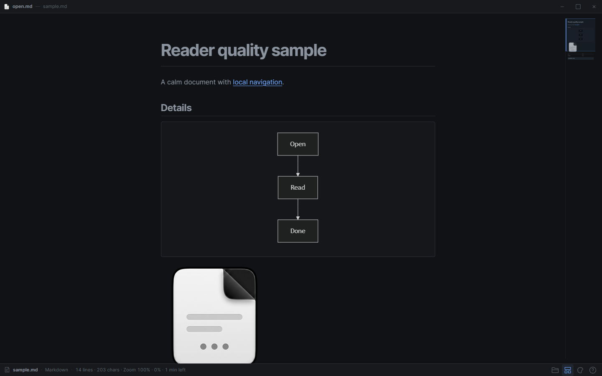
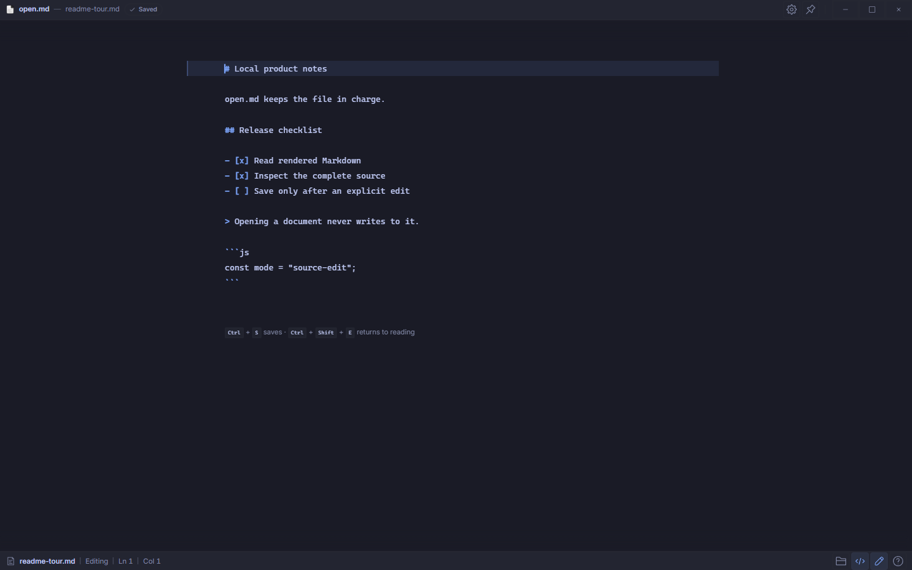
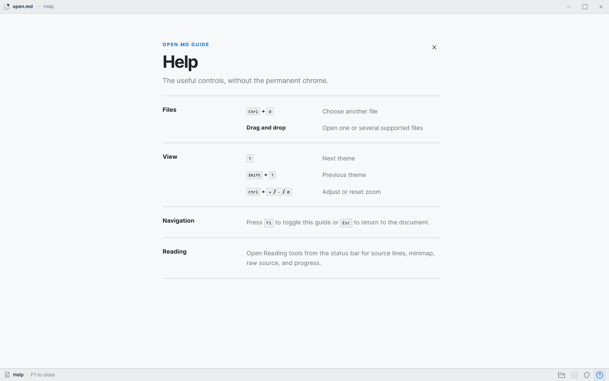
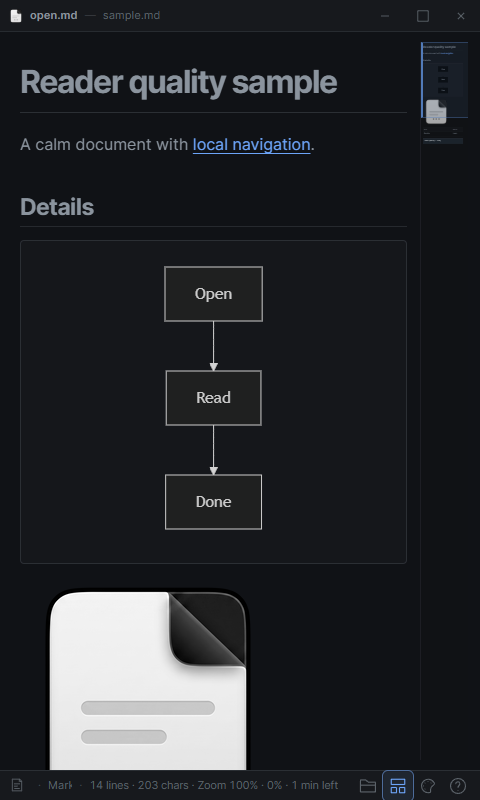

<p align="center">
  <picture>
    <source media="(prefers-color-scheme: dark)" srcset="https://shieldcn.dev/header/document.svg?title=open.md&subtitle=A+quiet%2C+local-first+Markdown+reader+and+editor&logo=tauri&theme=blue&align=center&mode=dark" />
    
  </picture>
</p>

<p align="center">
  <a href="https://github.com/gvastethecreator/open.md/actions/workflows/ci.yml"></a>
  <a href="https://gvastethecreator.github.io/open.md/"></a>
  <a href="https://github.com/gvastethecreator/open.md/stargazers"></a>
  <a href="https://github.com/gvastethecreator/open.md/commits/main"></a>
  <a href="LICENSE"></a>
</p>

A quiet desktop reader and editor for local Markdown and plain-text files.

[Project site](https://gvastethecreator.github.io/open.md/) · [Source and issues](https://github.com/gvastethecreator/open.md)

`open.md` is a small Tauri desktop application for reading and editing `.md`,
`.markdown`, and `.txt` files, plus companion formats opened in-app (JSON, CSV,
common config/text sidecars, and local raster images). Scene `.nfo` art and
`.log` files open for reading (and Source) only. Drop a file onto the
window, open it from the file picker, or use the operating system's **Open
with** menu. Documents stay local: the app does not fetch remote images.
Opening a file never writes to it; **Edit** and save change only the document
you choose to modify.

> Status: early development (`0.1.0` development milestone). The reading and
> editing paths are usable, but behavior may still change before a tagged
> release.

## Product tour

| Rendered reading                                                                                                                         | Source editing                                                                                                                     |
| ---------------------------------------------------------------------------------------------------------------------------------------- | ---------------------------------------------------------------------------------------------------------------------------------- |
|  |  |
| **Keyboard guide**                                                                                                                       | **Narrow window**                                                                                                                  |
|           |    |

## Features

- Markdown and plain-text reading, plus in-app companions (JSON, CSV, config-
  style text, and local raster images).
- Independent **Rendered/Source** and **Read only/Edit** controls. Markdown
  Rendered Edit uses Classic live preview (active line is source, other lines
  are rendered). Source Edit is the same full-file surface with raw syntax.
  Scene `.nfo` and `.log` companions keep Edit unavailable. See
  [Editing](docs/EDITING.md).
- Drag and drop, native file associations, and multi-window document opens.
  Optional single-instance mode (Advanced → System) reuses one process for
  Open with / second launches; multiple instances are allowed by default.
- Syntax-highlighted code blocks and Mermaid diagrams.
- Relative document links and bounded local images from the opened document's
  directory.
- Persistent themes, keyboard shortcuts, zoom controls, and reduced-motion
  support.

## Quick start

Install [Rust](https://www.rust-lang.org/), [Node.js](https://nodejs.org/), [pnpm](https://pnpm.io/), and the
platform dependencies required by
[Tauri](https://v2.tauri.app/start/prerequisites/).

```bash
pnpm install
pnpm run tauri dev
```

To run the frontend without a native window:

```bash
pnpm run dev
```

## Build locally

```bash
pnpm run tauri build
```

This creates a local bundle under `src-tauri/target/release/bundle/`. The
repository does not currently publish installers or hosted release binaries.

## Microsoft Store preparation

The planned Windows Store edition uses Partner Center's **EXE or MSI app**
route with a signed, offline, current-user NSIS installer. Repository-side
packaging, listing, privacy, hosting, certification, and lifecycle contracts
live in [the Store runbook](docs/store/README.md).

```powershell
pnpm run store:validate
```

The application is **not submission-ready yet**. Public submission remains
blocked until the product is reserved, a publicly trusted code-signing
certificate and immutable versioned HTTPS hosting are configured, the signed
Tauri updater is implemented, and the complete install/update/uninstall matrix
has evidence.

Read the bilingual [privacy policy](PRIVACY.md). The Store-facing privacy page
is published from `docs/privacy.html`.

## Documentation

- [Development and checks](docs/DEVELOPMENT.md) — project layout, local
  commands, and CI expectations.
- [Dependency updates](docs/DEPENDENCY_UPDATES.md) — resolved versions,
  changelogs, security overrides, and migration notes.
- [Quality audit](docs/QUALITY_AUDIT.md) — current gates, bundle budget, and
  residual release boundaries.
- [Current architecture](docs/architecture/CURRENT.md) — runtime ownership and
  lazy-loading boundaries.
- [Editing](docs/EDITING.md) — the four mode combinations, block tools, and save.
- [GitHub Pages landing](docs/PAGES.md) — local preview, deployment, and media
  provenance.
- [File associations](docs/FILE_ASSOCIATIONS.md) — how packaged builds
  integrate with the operating system's **Open with** flow.
- [Microsoft Store runbook](docs/store/README.md) — EXE submission, signing,
  hosting, updater, listing, and release evidence.
- [Privacy policy](PRIVACY.md) — local file, settings, retention, and network
  behavior in English and Spanish.
- [Bundled themes](docs/THEMES.md) — source provenance and licensing for the
  theme catalogue.
- [Contributing](CONTRIBUTING.md) — setup, pull requests, and contribution
  expectations.
- [Security policy](SECURITY.md).

## Support

Support continued development through [GitHub Sponsors](https://github.com/sponsors/gvastethecreator) or [Ko-fi](https://ko-fi.com/gvaste).

## License

`open.md` is distributed under the [MIT License](LICENSE). Bundled third-party
material has its own notices in [THIRD_PARTY_NOTICES.md](THIRD_PARTY_NOTICES.md).
