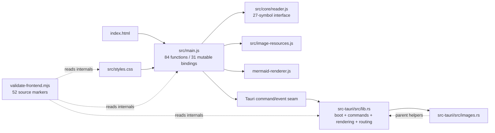
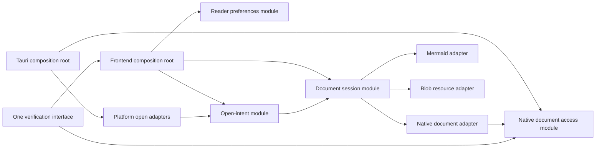

# Architecture review — open.md

Date: 2026-07-29
Repository revision: `60d1949e6b121e9f809d1c5e4f8c0293bec9f0a7` (`main`)
Status: recommendations ready; user decision pending
Canonical source: this Markdown file
Visual companion: `.scratch/reports/architecture-open-md/index.html`

> Architecture terms stay in English to match the project contract: **module**, **interface**, **implementation**, **depth**, **deep**, **shallow**, **seam**, **adapter**, **leverage**, and **locality**.

## Summary

- The app is healthy at the current revision: 47 frontend tests, 13 Rust tests, the static frontend check, and the production build pass.
- The remaining friction is structural. `src/main.js` has 1,915 physical lines, 84 top-level functions, and 31 top-level mutable bindings. Its behavior has no executable test seam.
- `src/core/reader.js` was a useful extraction, but its 27-symbol interface now exposes unrelated file, theme, viewport, source, native-request, and minimap calculations. The module is shallow at its interface even though its implementation contains valuable policy.
- One recent reader feature added 502 lines across eight files, including 226 lines in `src/main.js`. This change spread is the clearest locality signal.
- Five deepening moves are recommended. Start by making the app shell executable in tests, then deepen native document access and the frontend document session. Open intents and reader preferences follow as separate slices.
- No final interface is proposed here. Acceptance of each candidate is required before shared context, ADRs, workplan, or interface design.

## Executive decision

Approve, reject, or defer these candidates as a batch or one by one:

| ID | Recommendation | Severity | Strength | Decision |
|---|---|---:|---|---|
| ARC-01 | Deepen the frontend verification entrypoint | P2 | Strong | Pending |
| ARC-02 | Create a deep document session module | P2 | Strong | Pending |
| ARC-03 | Create a native document access module | P2 | Strong | Pending |
| ARC-04 | Create one open-intent seam | P2 | Medium | Pending |
| ARC-05 | Create a reader preferences module | P3 | Medium | Pending |

## Scope and method

### Scope

Inspected:

- `src/`, `src-tauri/src/`, `scripts/`, `index.html`, project manifests, Tauri configuration, public docs, tests, and recent Git history.
- Prior architecture and quality records under `.scratch/planning/` and `.local/archive/`.
- Production/test topology, mutable state, function spans, module imports, Tauri commands/events, storage schemas, and file-change coupling.

Excluded:

- Product remediation, dependency changes, final interface design, release work, Git history changes, and remote operations.
- Cross-platform native runtime smoke on macOS/Linux. Platform-specific file-open behavior was inspected statically and through existing tests only.

### Method

1. Restored prior decisions so accepted Mermaid, theme, and image work would not be proposed again.
2. Walked every production module and its tests.
3. Traced the document, image, preference, and file-open paths across JavaScript and Rust.
4. Measured change coupling and the latest feature change surface.
5. Applied the deletion test to existing and candidate modules.
6. Ran current focused tests and the production build.

### Confidence limits

- High confidence in source structure, call paths, current tests, build state, and Git coupling.
- Medium confidence in future maintenance cost because the repository has only 10 commits touching `src/main.js`.
- Limited confidence in macOS queue behavior and cross-platform window routing because no executable integration harness covers them.

## Evidence ledger

| Evidence | Observed fact | Source / command |
|---|---|---|
| E-01 | `src/main.js`: 1,915 physical lines, 84 top-level functions, 31 top-level mutable bindings. | PowerShell source inventory; `src/main.js` |
| E-02 | `src/core/reader.js`: 584 lines, 34 functions, 27 exports across several unrelated concerns. | export/function inventory; `src/core/reader.js` |
| E-03 | `src/main.js` changed in 10 commits; it co-changed with `index.html` and `src/styles.css` in 8, and with the validator, Rust root, and frontend tests in 7. | `git log --name-only --all` co-change aggregation |
| E-04 | Commit `39ec8fa` added 502 lines across eight files; 226 landed in `src/main.js`. | `git show --numstat 39ec8fa` |
| E-05 | `src/main.test.js` imports helpers from `src/core/reader.js`; no frontend test imports `src/main.js`, `document`, or `window`. | import/search audit; `src/main.test.js` |
| E-06 | `src/main.js` imports successfully but exports no test surface. | `bun -e "import('./src/main.js')..."` → `[]` |
| E-07 | The static validator has 332 lines, 52 `.includes(...)` checks, 46 thrown errors, and 13 `readFileSync(...)` call sites (excluding the import). | source inventory plus `rg -n 'readFileSync'`; `scripts/validate-frontend.mjs` |
| E-08 | `loadContent` spans 108 lines; `hydrateRelativeImages` spans 84; `loadRequestId` appears 15 times. | function-span and call-path inventory; `src/main.js:289`, `src/main.js:1065` |
| E-09 | The only `get_file_content` caller always sends a path, but Rust retains CLI/welcome fallback; JavaScript retains a legacy string payload no current adapter returns. | `src/main.js:1118`; `src/core/reader.js:29`; `src-tauri/src/lib.rs:47` |
| E-10 | `images.rs` depends on parent implementation helpers and JavaScript/Rust duplicate image MIME policy. | `src-tauri/src/images.rs:18`; `src/image-resources.js:3` |
| E-11 | Open behavior crosses CLI, single-instance, macOS event, Rust queue, event, acknowledgment, frontend queue, Promise chain, dedupe, and window policy. | `src-tauri/src/lib.rs:38-132`; `src/main.js:1662-1759` |
| E-12 | Four storage schemas live in `src/main.js`: theme, reading tools, font preferences, and always-on-top. | `src/main.js:46-49` and storage call audit |
| E-13 | Current executable checks pass. | `bun run check:frontend`; `bun run test:frontend` (47/47); `bun run test:rust` (13/13); `bun run build` |
| E-14 | Production build keeps Mermaid deferred; initial JS is 137,540 B. | `bun run build`; `scripts/check-bundle.mjs` |

## Preserved depth

These modules already earn their keep and should not be dissolved:

- `src/mermaid-renderer.js` is deep. Its small interface hides lazy import, strict configuration, singleton serialization, failed-import retry, queue recovery, and theme reset. Deleting it would push that complexity into every render caller.
- `src/image-resources.js` earns its seam. It owns byte accounting, budget failure, Blob creation, per-resource revocation, and document cleanup with focused failure tests. Deleting it would recreate resource lifecycle code inside the composition root.
- `src-tauri/src/images.rs` owns meaningful path containment and per-image limits. It needs deeper locality with document access, not deletion.
- The generated runtime theme projection is a settled performance decision. This review does not reopen it.

## Current shape

The graph has two hubs and one verification module that reads their implementation text. The goal is not more files. The goal is fewer caller obligations at real seams.

## Recommendations

### Claim classification

Every candidate uses the same explicit claim key:

- **Observed**: the **Evidence** subsection and its E-IDs.
- **Inference**: **Problem**, **Deletion test**, and **Benefits**.
- **Recommendation**: **Solution** and **Dependencies / sequencing**.
- **Verification**: **Acceptance criteria** and the named proof path.

### ARC-01 — Deepen the frontend verification entrypoint

**Severity**: P2
**Recommendation strength**: Strong
**Decision**: Pending

**Files**

- `scripts/validate-frontend.mjs`
- `src/main.js`
- `src/main.test.js`
- `package.json`
- `index.html`

**Problem**

The `check:frontend` command has useful leverage, but its behavior checks are shallow: the implementation asserts literal function names, selectors, imports, and invocation text instead of executing the reader shell. A correct move across modules can fail; broken event ordering can pass.

**Evidence**

- The validator contains 52 source-string checks and 46 possible thrown errors.
- Frontend tests never import `src/main.js` or exercise DOM/Tauri behavior.
- `src/main.js` exports no test surface.
- Current tests pass, so this is a proof-gap finding, not a current regression claim.

**Deletion test**

Deleting the source-marker checks removes their claims; behavior complexity does not reappear at a test seam. Keep the real file/config/data checks. Replace behavior markers behind the same command interface with executable proof.

**Solution**

Deepen the existing verification entrypoint. Keep one caller interface for local development and CI, but let its implementation combine:

- deterministic static checks for assets, config, generated theme parity, and security invariants;
- an executable reader-shell seam with a real DOM plus fake Tauri and storage adapters;
- focused scenarios for load success/failure, stale requests, cleanup, open routing, preferences, and keyboard/panel state.

Do not choose the final test interface until this recommendation is accepted.

**Benefits**

- locality: behavior assertions live with the seam they execute, not with source spelling.
- leverage: one verification interface covers static invariants and real shell behavior.
- interface shrinks for refactors: CI keeps one command while implementation can move freely.

**Before / After**

- Before: CI → one command → implementation text and assets read directly by the validator.
- After: CI → same command → static invariants + executable shell scenarios.

**Dependencies / sequencing**

- First in the set. It provides the safety net for ARC-02 through ARC-05.
- Preserve every current static invariant until an executable check or stronger structural check replaces it.

**Acceptance criteria**

- A behavior-preserving rename or move no longer fails due to source spelling.
- At least one stale-load case and one dependency-failure case execute through the public shell seam.
- Static theme/config/asset checks still fail on real drift.
- Existing 47 frontend tests remain green.

**Documentation follow-ups**

- Update `docs/DEVELOPMENT.md` with the proof split.
- Add ARC-01 to `docs/architecture/WORKPLAN.md` if accepted.
- No ADR expected; the choice is reversible and unsurprising.

### ARC-02 — Create a deep document session module

**Severity**: P2
**Recommendation strength**: Strong
**Decision**: Pending

**Files**

- `src/main.js`
- `src/core/reader.js`
- `src/image-resources.js`
- `src/mermaid-renderer.js`
- `src/main.test.js`
- `src/image-resources.test.js`
- `src/mermaid-renderer.test.js`

**Problem**

The document lifecycle leaks across the composition root. Callers must know request IDs, Blob cleanup, DOM connectivity, image concurrency, table/code enhancement order, Mermaid order, theme choice, focus, status, minimap invalidation, and error recovery. `core/reader.js` exposes individual calculations rather than hiding that lifecycle behind one deep interface.

**Evidence**

- `loadContent` is 108 lines and `hydrateRelativeImages` is 84.
- `loadRequestId` appears 15 times.
- One load touches loading state, native invoke, payload normalization, HTML/source rendering, images, tables, code, Mermaid, reading tools, focus, status, and scroll state.
- No test executes the whole path.

**Deletion test**

Deleting `image-resources.js` or `mermaid-renderer.js` would push real lifecycle complexity into `src/main.js`; both earned their seams. Deleting `core/reader.js` would spread 27 policies back into the root, but its current interface is shallow. The deepening move is to absorb orchestration and make most helpers implementation details while preserving earned adapters.

**Solution**

Create a document session module that owns one document's open, cancel, render, enrich, focus-ready, and cleanup lifecycle. Treat native document loading, Mermaid, and Blob resources as adapters at the session seam. Keep `src/main.js` responsible for composition and event wiring.

Do not define methods, event shapes, or ownership transfer rules until interface design is accepted.

**Benefits**

- locality: stale-request, render-order, resource, and recovery bugs concentrate in one module.
- leverage: one interface serves picker, links, drag/drop, initial launch, and open-intent routing.
- test seam: fake native/Mermaid/resource adapters can prove ordering and failure without a full desktop runtime.
- interface shrinks; implementation absorbs request IDs and helper choreography.

**Before / After**

- Before: every open caller reaches `loadContent`, which coordinates seven implementation concerns in place.
- After: open callers address one session seam; its adapters keep their existing depth.

**Dependencies / sequencing**

- Start after ARC-01 has one executable happy path and one stale/failure path.
- Keep the current Tauri command contract during the first slice; ARC-03 can deepen native ownership separately.
- Use expand-contract: add session path, migrate callers, then remove old orchestration after parity proof.

**Acceptance criteria**

- The composition root no longer owns request IDs or image-resource cleanup.
- A stale document cannot mutate DOM, status, focus, minimap, or retained Blob resources.
- Load success, load failure, image failure, Mermaid failure, and close/replace cleanup execute at the session seam.
- Existing focused tests and production bundle gates pass.

**Documentation follow-ups**

- Add **Document session** to `CONTEXT.md` if accepted.
- Add ARC-02 to the architecture workplan.
- Offer an ADR only if the accepted interface changes cross-runtime ownership or cancellation semantics.

### ARC-03 — Create a native document access module

**Severity**: P2
**Recommendation strength**: Strong
**Decision**: Pending

**Files**

- `src-tauri/src/lib.rs`
- `src-tauri/src/images.rs`
- `src/core/reader.js`
- `src/main.js`
- `src-tauri/Cargo.toml`

**Problem**

The Tauri command seam is deep for the frontend, but its implementation is not local. `lib.rs` owns boot, commands, window creation, open routing, filesystem policy, document rendering, source anchors, stats, and tests. `images.rs` depends upward on parent implementation helpers. JavaScript and Rust both decide supported extensions and image MIME types.

**Evidence**

- `src-tauri/src/lib.rs` has 531 physical lines; Markdown rendering alone spans 98 lines.
- `images.rs` calls `super::is_supported_extension`, `super::user_friendly_read_error`, and `super::file_size_label`.
- Image MIME tables exist in both `src/image-resources.js` and `src-tauri/src/images.rs`.
- The frontend always supplies a path to `get_file_content`, yet Rust keeps CLI/welcome fallback; JavaScript keeps an unused legacy string payload path.

**Deletion test**

Deleting `images.rs` would move path containment, MIME allowlisting, byte limits, and filesystem errors into `lib.rs`; the module earned its seam. Its upward dependencies show incomplete depth. A native document access module should own shared file policy and make `lib.rs` a small composition root.

**Solution**

Create one native document access module that owns supported document policy, canonical file access, Markdown/plain-text rendering, document metadata, and related local-resource policy. Keep Tauri command registration and platform boot as adapters. Remove dead compatibility only after executable contract proof.

The validated native owner should remain authoritative for file/resource type. Exact payload shape and command names belong to later interface design.

**Benefits**

- locality: filesystem, rendering, type, limit, and error knowledge sit together.
- leverage: Tauri commands, tests, and future resource reads use one native interface.
- interface clarity: the frontend consumes one current contract instead of normalizing active and legacy forms.
- test seam: native document cases execute without constructing the full Tauri app.

**Before / After**

- Before: `lib.rs` is both app composition and document implementation; `images.rs` reaches back into it.
- After: Tauri composition calls deep native modules; document/resource policy no longer points upward.

**Dependencies / sequencing**

- Begin after ARC-01 protects the current frontend/native payload.
- Land behind unchanged commands first.
- Coordinate payload changes with ARC-02 only after each module has independent parity proof.

**Acceptance criteria**

- `lib.rs` contains boot, adapter registration, and minimal platform composition only.
- `images.rs` has no dependency on parent implementation helpers.
- One authoritative place owns extension and validated media-type policy per runtime responsibility.
- Dead welcome/legacy paths are removed or justified by an active caller.
- Rust document, resource, invalid UTF-8, size-limit, unsupported type, and containment tests pass.

**Documentation follow-ups**

- Add **Native document access** and **Document resource** to `CONTEXT.md` if accepted.
- Add ARC-03 to the architecture workplan.
- Offer an ADR if ownership of media type, rendered HTML, or source metadata changes across the Tauri seam.

### ARC-04 — Create one open-intent seam

**Severity**: P2
**Recommendation strength**: Medium
**Decision**: Pending

**Files**

- `src/main.js`
- `src/core/reader.js`
- `src-tauri/src/lib.rs`
- `docs/FILE_ASSOCIATIONS.md`
- `src/main.test.js`

**Problem**

Open policy is distributed across five real adapters: picker, drag/drop, CLI/single-instance, macOS file events, and document links. Queueing, deduplication, readiness, acknowledgment, supported-file filtering, and current/new-window decisions live in both Rust and JavaScript.

**Evidence**

- Rust owns `OpenFileRequest`, a pending queue, event emission, acknowledgment, CLI parsing, single-instance handling, macOS events, and window creation.
- JavaScript owns normalization, a pre-ready queue, Promise serialization, handled IDs, supported-file filtering, and the current/new-window rule.
- Tests cover serialization, normalization, and initial argument selection only.
- `docs/FILE_ASSOCIATIONS.md` defines platform behavior that no executable integration test currently proves.

**Deletion test**

The five ingress adapters justify a real seam. Without an open-intent module, delivery/order/window policy reappears in each adapter. One adapter would be hypothetical; five are concrete.

**Solution**

Define **Open intent** as the canonical domain request to open one or more supported documents, including origin and current-window context. Create one module that owns normalization, ordering, duplicate delivery, readiness, and window policy. Keep CLI, single-instance, macOS event, picker, drag/drop, and link entry as adapters.

Final intent fields, acknowledgment semantics, and ownership between Rust and JavaScript require accepted interface design.

**Benefits**

- locality: duplicate/order/window bugs concentrate in one module.
- leverage: five adapters use one policy interface.
- test seam: queue-before-ready, duplicate event+pending delivery, unsupported batches, and current/new-window behavior become deterministic.
- documentation matches one domain term instead of describing implementation channels.

**Before / After**

- Before: every origin partially decides support, readiness, or window behavior.
- After: origins translate to one intent; one policy module decides the outcome.

**Dependencies / sequencing**

- Follow ARC-02 so opening a document targets one session seam.
- Preserve `docs/FILE_ASSOCIATIONS.md` behavior as the acceptance fixture.
- Keep platform adapters intact until duplicate/order tests cover expand-contract migration.

**Acceptance criteria**

- Every ingress origin maps to one intent model.
- Duplicate macOS event/pending delivery opens each path once.
- Requests received before readiness preserve order.
- Picker/drop replace the current document; OS association preserves the current document and opens a new window when required by policy.
- Unsupported inputs produce one consistent result and feedback path.

**Documentation follow-ups**

- Add **Open intent** to `CONTEXT.md` if accepted.
- Update `docs/FILE_ASSOCIATIONS.md` to describe the domain policy first and platform adapters second.
- Offer an ADR because cross-platform delivery and acknowledgment trade-offs are surprising and costly to reverse.

### ARC-05 — Create a reader preferences module

**Severity**: P3
**Recommendation strength**: Medium
**Decision**: Pending

**Files**

- `src/main.js`
- `src/core/reader.js`
- `src/main.test.js`
- `index.html`
- `src/styles.css`
- `src-tauri/capabilities/default.json`

**Problem**

Reader preference schemas and apply rules live in the composition root. Theme, reading tools, fonts, and always-on-top each implement storage, fallback, mutable state, control sync, and feedback separately. The latest feature extended this pattern instead of increasing depth.

**Evidence**

- Four storage keys live at `src/main.js:46-49`.
- The latest feature added 226 lines to `src/main.js`, including font persistence, native window preference, control state, and panel coordination.
- Pure normalizer tests cover malformed values; no test executes load → apply → change → save → restore.
- The current module also coordinates mutual exclusion among reading tools, typography, help, and pinned actions.

**Deletion test**

A reader preferences module would earn its seam: deleting it would recreate schemas, defaults, fallbacks, persistence errors, and apply rules across theme, tools, fonts, and window code. Browser storage and an in-memory test adapter are two real adapters.

**Solution**

Create a deep reader preferences module that owns current schemas, defaults, normalization, persistence, and change notifications. Keep DOM rendering and transient panel choreography in the composition root during the first slice. Treat native always-on-top as an adapter with explicit failure recovery.

Do not introduce a generic settings framework. The module should cover only current reader preferences and their invariants.

**Benefits**

- locality: storage/schema/fallback changes concentrate in one module.
- leverage: theme, reading tools, typography, and window preference use one persistence interface.
- test seam: load/apply/save/restore and corrupt storage can execute with an in-memory adapter.
- interface shrinks; `src/main.js` stops knowing storage keys and parse rules.

**Before / After**

- Before: each preference owns its own localStorage and error branch in `src/main.js`.
- After: the composition root observes one preference model and renders controls; persistence stays behind one seam.

**Dependencies / sequencing**

- Last in this set. It has lower operational risk than document/open paths.
- Use ARC-01 to prove persistence failure and native always-on-top failure.
- Avoid combining this slice with transient panel-state redesign.

**Acceptance criteria**

- `src/main.js` contains no storage key or JSON parsing for reader preferences.
- Existing stored values restore without migration loss.
- Corrupt or unavailable storage falls back and remains usable.
- Native always-on-top failure rolls state and control feedback back consistently.
- Theme, tool, font, and window preference tests execute through one interface.

**Documentation follow-ups**

- Add **Reader preferences** to `CONTEXT.md` if accepted.
- Add ARC-05 to the architecture workplan.
- No ADR expected unless storage compatibility or native ownership changes materially.

## Target ownership shape

This diagram names candidate modules and adapters only. It is not final interface design.

## Decisions and trade-offs

### Settled before this review

- Accepted: keep Mermaid lazy and serialized behind `src/mermaid-renderer.js`.
- Accepted: keep raw bounded image IPC and deterministic Blob cleanup.
- Accepted: keep all 364 themes through the generated runtime projection.
- Accepted: keep `src/main.js` as the composition root until concrete friction justifies deeper modules. E-01 through E-12 now provide that evidence.
- Rejected: framework rewrite, generic dependency injection across every module, and splitting every UI concern into small pass-through modules.

### Pending user choices

- Accept, reject, or defer ARC-01 through ARC-05.
- Choose one accepted candidate for interface design first. ARC-01 is recommended.
- Decide whether ARC-04 merits an ADR for cross-platform delivery semantics.

## Suggested execution order

1. **ARC-01 — Verification entrypoint.** First because every later structural move needs executable parity proof.
2. **ARC-03 — Native document access.** Shrink `lib.rs` behind unchanged commands and remove upward policy dependencies before changing the cross-runtime contract.
3. **ARC-02 — Document session.** Move load/cancel/render/cleanup behind one frontend seam while keeping native, Mermaid, and Blob adapters stable.
4. **ARC-04 — Open intent.** Route five ingress adapters into the document session after both ends have stable test seams.
5. **ARC-05 — Reader preferences.** Lower-risk locality work after document/open behavior is isolated.

## Prioritized workplan

| Order | Candidate | Dependency | Acceptance result | Owner / authority | Verification path |
|---:|---|---|---|---|---|
| 1 | ARC-01 | User acceptance | One command proves static invariants plus real shell behavior. | Implementation agent; user approves candidate/interface scope. | Existing tests + new shell scenarios + production build. |
| 2 | ARC-03 | ARC-01 shell/payload proof | `lib.rs` is composition; document/resource policy is local and dead paths are resolved. | Rust implementation agent; user approves any contract/ADR change. | Rust module tests + frontend payload scenario. |
| 3 | ARC-02 | ARC-01; stable ARC-03 command path | One session owns load through cleanup; callers no longer know request IDs/resources. | Frontend implementation agent; user approves interface design. | Session tests + browser/Tauri smoke + bundle gate. |
| 4 | ARC-04 | ARC-02 session seam | Five adapters preserve order, dedupe, support, and window policy. | Cross-runtime implementation agent; user owns ADR decision. | Deterministic queue tests + platform smoke where available. |
| 5 | ARC-05 | ARC-01 | One preferences seam owns schema/persistence/fallback. | Frontend implementation agent. | In-memory storage tests + browser restore/failure smoke. |

## Documentation fan-out

After acceptance, keep this review as the index and fan out only settled decisions:

- `CONTEXT.md`: add **Document session**, **Native document access**, **Document resource**, **Open intent**, and **Reader preferences** for accepted candidates.
- `docs/adr/0001-open-intent-delivery.md`: create only if ARC-04 is accepted and the chosen cross-platform delivery/acknowledgment trade-off is surprising or hard to reverse.
- A document-contract ADR: create only if ARC-02/ARC-03 move rendered HTML, media type, cancellation, or source metadata ownership across the Tauri seam.
- `docs/architecture/WORKPLAN.md`: track all accepted recommendations, dependencies, acceptance criteria, and verification.
- `docs/DEVELOPMENT.md`: update the verification and module map after implementation lands.

## Verification

### Checks run

| Check | Result | Notes |
|---|---|---|
| Git baseline | Passed | Started from clean `main...origin/main`; only requested planning/report artifacts were added. |
| `bun run check:frontend` | Passed | 364 themes found. |
| `bun run test:frontend` | Passed | 4 files, 47 tests. |
| `bun run test:rust` | Passed after cold compile timeout | First 184 s attempt timed out; warmed rerun passed 13 tests with linker-message warnings only. |
| `bun run build` | Passed | 103 assets; initial JS 137,540 B; Mermaid deferred. |
| Source/call-path audit | Passed | All material claims map to E-01 through E-14. |
| HTML containment | Passed | Both normal and `--report` modes returned `HTML_LAB_VALID`; the companion directory contains one file and no external URL/path. |
| Browser desktop/narrow/semantics | Passed | 1440×1000 and 390×844 rendered with no page overflow or console warnings/errors; internal navigation, landmarks, headings, named scroll regions, and sampled AA contrast passed. |
| Keyboard traversal | Limited | The skip link and five scroll regions received visible focus, but the in-app browser backend did not advance or activate default behavior from synthetic Tab/Enter; full physical traversal is not claimed. |
| Static visual pressure | Passed with contextual findings | No P1; P2/P3 detector leads were reconciled against live overflow, contrast, label, and capture evidence. |
| Independent review | Passed after repair | Fresh review found four repairable gaps: final ledger state, claim labels, companion parity, and E-07 precision. All were reconciled before delivery. |

### Skipped checks

- No product runtime mutation occurred, so no before/after app screenshot is claimed.
- macOS/Linux file-open runtime smoke remains unavailable on this Windows host.
- No architecture improvement is claimed yet; this is an audit and recommendation artifact.

## Residual risks

- The current tests are green but do not execute `src/main.js`; behavior confidence remains lower than helper confidence.
- Co-change evidence spans only 10 `src/main.js` commits. It shows repeated locality pressure but cannot predict every future change.
- Native open routing has platform-specific branches. Static evidence cannot prove event timing on macOS.
- Changing the ARC-02/ARC-03 cross-runtime contract in one batch would raise regression and rollback cost; preserve expand-contract sequencing.
- Candidate module names express ownership, not accepted final interfaces.
- A broad refactor could create shallow pass-through modules if execution ignores the deletion test and expand-contract order.

## Acceptance request

For each candidate, record one status: **accepted**, **rejected**, or **deferred**. If the batch is accepted, start interface design with ARC-01, then create the shared context, ADR, and workplan documents described above.
