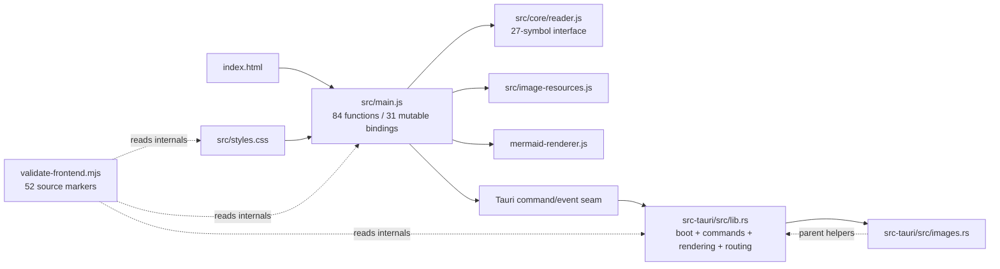
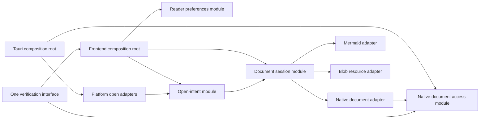

# Architecture review — open.md

Date: 2026-07-29; execution updates: 2026-07-30
Repository baseline: `f6f6a25`; post-acceptance hardening is in the current working tree on `codex/arc-01-05-architecture`
Status: ARC-01 through ARC-25 accepted, implemented, and locally verified; packaged cross-platform smoke remains a platform gate
Canonical source: this Markdown file
Historical visual companion (review baseline only): `.scratch/reports/architecture-open-md/index.html`
Current visual companion: [`.scratch/reports/architecture-open-md-followup/index.html`](../../.scratch/reports/architecture-open-md-followup/index.html)

> Architecture terms stay in English to match the project contract: **module**, **interface**, **implementation**, **depth**, **deep**, **shallow**, **seam**, **adapter**, **leverage**, and **locality**.

## Summary

Current outcome (2026-07-30):

- Ten additional lifecycle and interaction owners were implemented as ARC-16
  through ARC-25 without changing the public reader-shell contract. The root
  is now 880 physical lines; its remaining role is acquisition order, adapters,
  event bindings, and cross-module callbacks.
- The full local gate passed 212 frontend tests in 33 files, four executable
  reader-shell checks, static/page checks, the production build and bundle
  budgets, Rust formatting/checking, and 15 Rust tests. `bun run verify`
  completed in 42 seconds with the longer bounded build window.
- The new modules have focused DOM/controller contracts for viewport, status,
  editor feedback, content actions, document identity, ingress, keyboard,
  runtime adapters, and application lifecycle. The accepted ownership ledger
  is the [architecture workplan](WORKPLAN.md).
- The first adversarial review blocked closure with six confirmed defects and
  one initialization risk. Three hardening commits closed all seven; the fresh
  re-review reports zero P1, P2, or P3 defect.
- Settled ownership is recorded in [CONTEXT.md](../../CONTEXT.md) and the
  [development guide](../DEVELOPMENT.md).
- Post-refactor live-browser proof is not claimed: the required existing-Chrome
  bridge was unavailable on this host. The earlier UI slice has live desktop
  proof; the architecture batch is covered by executable DOM tests and the
  complete local gate.

## Execution update — ARC-16..25

This follow-up was executed as exactly ten non-overlapping tickets. Each ticket
has one focused module, a contract test, a workplan entry, and one logical
commit. The public `mountReaderShell` shape, Open Intent policy, document
session lifecycle, preferences model, and native filesystem policy remain in
their established owners.

| ID | New owner | Responsibility moved out of `main.js` | Proof |
|---|---|---|---|
| ARC-16 | `reader-controls.js` | Preference projection, panels, fonts, reading tools, auto-save, pinning, focus, and scroll memory | `reader-controls.test.js` plus full frontend suite |
| ARC-17 | `status-presenter.js` | Status identity, reusable metrics, zoom motion, reduced motion, and clear/dispose | `status-presenter.test.js` |
| ARC-18 | `reader-viewport-controller.js` | Empty/content/source/help projection, ARIA/inert state, page/body state, focus, and help scroll reset | `reader-viewport-controller.test.js` |
| ARC-19 | `editor-feedback-presenter.js` | Save button state, icon, label, tooltip, ARIA, and editor save classes | `editor-feedback-presenter.test.js` |
| ARC-20 | `document-content-actions.js` | Read/Source/Edit context actions, selection, clipboard fallback, paste, tasks, and block commands | `document-content-actions.test.js` |
| ARC-21 | `document-ingress-controller.js` | Picker, native association replay/ack, drag safety/drop, dirty guards, and ingress teardown | `document-ingress-controller.test.js` |
| ARC-22 | `document-view-state.js` | Document identity and loading/ready/failed/idle/replacement fan-out | `document-view-state.test.js` |
| ARC-23 | `application-runtime-adapters.js` | Native/preview document, save, image, syntax, Mermaid, storage, and window adapters | `application-runtime-adapters.test.js` |
| ARC-24 | `reader-keyboard-controller.js` | Shortcut precedence, editable-target guards, help/panels, edit, save, open, zoom, and themes | `reader-keyboard-controller.test.js` |
| ARC-25 | `application-lifecycle.js` | Mount order, event binding, startup failure cleanup, beforeunload, and idempotent teardown | `application-lifecycle.test.js` |

### Settled interface decisions

- `main.js` remains an assembly root. No generic event bus, dependency map, or
  dependency-injection container was added.
- Runtime adapters preserve the existing Reader shell adapter shape. Native
  and preview branches are real adapters; browser file access fails with the
  stable `NATIVE_ACCESS_UNAVAILABLE` contract.
- View state owns document identity, while the Document Session still owns
  render/enrichment/resource generations and Open Intent still owns path,
  window, deduplication, readiness, and acknowledgment policy.
- Ingress owns transport listeners and picker/drop lifecycle, but submits all
requests through Open Intent. Keyboard and content actions use injected
callbacks instead of reaching into unrelated module state.

## Post-acceptance hardening — 2026-07-30

A fresh bounded pass found six evidence-backed candidates after ARC-01..25,
not the ten required for a new architecture batch. No ARC-26..35 ledger or new
HTML completion report was created; splitting cohesive modules to meet a count
would be padding.

Independent review did find three P2 contradictions inside already accepted
contracts, so ARC-09, ARC-12 and ARC-25 were hardened without creating new
ticket IDs:

- Document mode work now captures document identity before async transitions,
  refuses to finish against a replacement document, and preserves the exact
  reader scroll position across Read, Edit and Source. Initial editor focus and
  the direct Source control also preserve scroll.
- Editor-session disposal now removes its four canvas listeners before
  disposing child controllers.
- Application lifecycle now registers controllers and listeners at their
  acquisition sites and tears them down in reverse order. The parallel
  `applicationDisposables()` ledger was removed, closing the omitted
  `documentViewState` and `contextMenuController` cleanup paths.

The final adversarial diff review then exposed queued mode requests that could
adopt a replacement identity, a stale Source-view RAF that could restore scroll
after replacement/disposal, and retained owner identities after teardown.
Those three P2 gaps were reproduced and repaired; the re-review accepted the
result with no residual actionable finding in scope.

The remaining three candidates are P3 follow-up work: an executable whole-app
composition seam, consolidation of task-save view fan-out, and consolidation
of Tauri ingress wiring. They are intentionally not presented as a ten-ticket
batch. The final local gate passed 220 frontend tests in 33 files, four shell
scenarios, static/Pages checks, the production build and bundle budget, Rust
format/check, and 15 Rust tests. Existing browser-profile and packaged
cross-platform gates remain unclaimed.

### ARC-16..25 verification record

| Gate | Result |
|---|---|
| `bun run check:frontend` | Passed: static, shell, and Pages checks; 364 themes and 11 local Pages references |
| `bun run test:frontend` | Passed: 33 files, 212 tests |
| `bun run build` | Passed: Vite transformed 2,130 modules; bundle check passed with 107 assets |
| `bun run fmt:rust` | Passed |
| `bun run check:rust` | Passed; Windows incremental-cache access warning only |
| `bun run test:rust` | Passed: 15 tests |
| `bun run verify` | Passed end to end in 42 seconds with the extended bounded window |

### Residual risks and limits

- Live existing-Chrome/profile proof remains unavailable because the required
  bridge is not installed. DOM/controller tests and the full local gate are
  not a substitute for that manual runtime proof.
- The production build still reports Vite's existing advisory about chunks
  above 500 kB; the repository bundle budget passed.
- Rust keeps the known Windows incremental-cache and linker stdout warnings;
  they do not fail the gates and no Rust source changed in this batch.

Historical review baseline:

- At the reviewed revision, the app was healthy: 47 frontend tests, 13 Rust
  tests, the static frontend check, and the production build passed.
- The remaining friction is structural. `src/main.js` has 1,915 physical lines, 84 top-level functions, and 31 top-level mutable bindings. Its behavior has no executable test seam.
- `src/core/reader.js` was a useful extraction, but its 27-symbol interface now exposes unrelated file, theme, viewport, source, native-request, and minimap calculations. The module is shallow at its interface even though its implementation contains valuable policy.
- One recent reader feature added 502 lines across eight files, including 226 lines in `src/main.js`. This change spread is the clearest locality signal.
- All five deepening moves were accepted and implemented in the proposed order:
  executable shell, native document access, document session, open intent, and
  reader preferences.
- The selected interface is a DOM-bound reader-shell facade with deep domain
  owners and ports only where multiple real adapters exist. Shared context,
  workplan, and the open-delivery ADR now record the settled design.

## Executive decision

Implementation outcome:

| ID | Recommendation | Severity | Strength | Decision |
|---|---|---:|---|---|
| ARC-01 | Deepen the frontend verification entrypoint | P2 | Strong | Accepted · implemented |
| ARC-02 | Create a deep document session module | P2 | Strong | Accepted · implemented |
| ARC-03 | Create a native document access module | P2 | Strong | Accepted · implemented |
| ARC-04 | Create one open-intent seam | P2 | Medium | Accepted · implemented |
| ARC-05 | Create a reader preferences module | P3 | Medium | Accepted · implemented |

## Scope and method

### Scope

Inspected:

- `src/`, `src-tauri/src/`, `scripts/`, `index.html`, project manifests, Tauri configuration, public docs, tests, and recent Git history.
- Prior architecture and quality records under `.scratch/planning/` and `.local/archive/`.
- Production/test topology, mutable state, function spans, module imports, Tauri commands/events, storage schemas, and file-change coupling.

Excluded:

- Product remediation, dependency changes, final interface design, release work, Git history changes, and remote operations.
- Cross-platform native runtime smoke on macOS/Linux. Platform-specific file-open behavior was inspected statically and through existing tests only.

### Method

1. Restored prior decisions so accepted Mermaid, theme, and image work would not be proposed again.
2. Walked every production module and its tests.
3. Traced the document, image, preference, and file-open paths across JavaScript and Rust.
4. Measured change coupling and the latest feature change surface.
5. Applied the deletion test to existing and candidate modules.
6. Ran current focused tests and the production build.

### Confidence limits

- High confidence in source structure, call paths, current tests, build state, and Git coupling.
- Medium confidence in future maintenance cost because the repository has only 10 commits touching `src/main.js`.
- Limited confidence in macOS queue behavior and cross-platform window routing because no executable integration harness covers them.

## Evidence ledger

| Evidence | Observed fact | Source / command |
|---|---|---|
| E-01 | `src/main.js`: 1,915 physical lines, 84 top-level functions, 31 top-level mutable bindings. | PowerShell source inventory; `src/main.js` |
| E-02 | `src/core/reader.js`: 584 lines, 34 functions, 27 exports across several unrelated concerns. | export/function inventory; `src/core/reader.js` |
| E-03 | `src/main.js` changed in 10 commits; it co-changed with `index.html` and `src/styles.css` in 8, and with the validator, Rust root, and frontend tests in 7. | `git log --name-only --all` co-change aggregation |
| E-04 | Commit `39ec8fa` added 502 lines across eight files; 226 landed in `src/main.js`. | `git show --numstat 39ec8fa` |
| E-05 | `src/main.test.js` imports helpers from `src/core/reader.js`; no frontend test imports `src/main.js`, `document`, or `window`. | import/search audit; `src/main.test.js` |
| E-06 | `src/main.js` imports successfully but exports no test surface. | `bun -e "import('./src/main.js')..."` → `[]` |
| E-07 | The static validator has 332 lines, 52 `.includes(...)` checks, 46 thrown errors, and 13 `readFileSync(...)` call sites (excluding the import). | source inventory plus `rg -n 'readFileSync'`; `scripts/validate-frontend.mjs` |
| E-08 | `loadContent` spans 108 lines; `hydrateRelativeImages` spans 84; `loadRequestId` appears 15 times. | function-span and call-path inventory; `src/main.js:289`, `src/main.js:1065` |
| E-09 | The only `get_file_content` caller always sends a path, but Rust retains CLI/welcome fallback; JavaScript retains a legacy string payload no current adapter returns. | `src/main.js:1118`; `src/core/reader.js:29`; `src-tauri/src/lib.rs:47` |
| E-10 | `images.rs` depends on parent implementation helpers and JavaScript/Rust duplicate image MIME policy. | `src-tauri/src/images.rs:18`; `src/image-resources.js:3` |
| E-11 | Open behavior crosses CLI, single-instance, macOS event, Rust queue, event, acknowledgment, frontend queue, Promise chain, dedupe, and window policy. | `src-tauri/src/lib.rs:38-132`; `src/main.js:1662-1759` |
| E-12 | Four storage schemas live in `src/main.js`: theme, reading tools, font preferences, and always-on-top. | `src/main.js:46-49` and storage call audit |
| E-13 | Current executable checks pass. | `bun run check:frontend`; `bun run test:frontend` (47/47); `bun run test:rust` (13/13); `bun run build` |
| E-14 | Production build keeps Mermaid deferred; initial JS is 137,540 B. | `bun run build`; `scripts/check-bundle.mjs` |

## Preserved depth

These modules already earn their keep and should not be dissolved:

- `src/mermaid-renderer.js` is deep. Its small interface hides lazy import, strict configuration, singleton serialization, failed-import retry, queue recovery, and theme reset. Deleting it would push that complexity into every render caller.
- `src/image-resources.js` earns its seam. It owns byte accounting, budget failure, Blob creation, per-resource revocation, and document cleanup with focused failure tests. Deleting it would recreate resource lifecycle code inside the composition root.
- `src-tauri/src/document_access.rs` now owns path containment and per-image
  limits; `src-tauri/src/images.rs` remains a thin binary-response adapter.
- The generated runtime theme projection is a settled performance decision. This review does not reopen it.

## Reviewed baseline shape

The graph has two hubs and one verification module that reads their implementation text. The goal is not more files. The goal is fewer caller obligations at real seams.

## Recommendations

### Claim classification

Every candidate uses the same explicit claim key:

- **Observed**: the **Evidence** subsection and its E-IDs.
- **Inference**: **Problem**, **Deletion test**, and **Benefits**.
- **Recommendation**: **Solution** and **Dependencies / sequencing**.
- **Verification**: **Acceptance criteria** and the named proof path.

### ARC-01 — Deepen the frontend verification entrypoint

**Severity**: P2
**Recommendation strength**: Strong
**Decision**: Accepted and implemented in `bc1977a`

**Files**

- `scripts/validate-frontend.mjs`
- `src/main.js`
- `src/main.test.js`
- `package.json`
- `index.html`

**Problem**

The `check:frontend` command has useful leverage, but its behavior checks are shallow: the implementation asserts literal function names, selectors, imports, and invocation text instead of executing the reader shell. A correct move across modules can fail; broken event ordering can pass.

**Evidence**

- The validator contains 52 source-string checks and 46 possible thrown errors.
- Frontend tests never import `src/main.js` or exercise DOM/Tauri behavior.
- `src/main.js` exports no test surface.
- Current tests pass, so this is a proof-gap finding, not a current regression claim.

**Deletion test**

Deleting the source-marker checks removes their claims; behavior complexity does not reappear at a test seam. Keep the real file/config/data checks. Replace behavior markers behind the same command interface with executable proof.

**Solution**

Deepen the existing verification entrypoint. Keep one caller interface for local development and CI, but let its implementation combine:

- deterministic static checks for assets, config, generated theme parity, and security invariants;
- an executable reader-shell seam with a real DOM plus fake Tauri and storage adapters;
- focused scenarios for load success/failure, stale requests, cleanup, open routing, preferences, and keyboard/panel state.

The accepted interface keeps static invariants in the validator and executes
the public `mountReaderShell` seam over the real HTML with fake adapters.

**Benefits**

- locality: behavior assertions live with the seam they execute, not with source spelling.
- leverage: one verification interface covers static invariants and real shell behavior.
- interface shrinks for refactors: CI keeps one command while implementation can move freely.

**Before / After**

- Before: CI → one command → implementation text and assets read directly by the validator.
- After: CI → same command → static invariants + executable shell scenarios.

**Dependencies / sequencing**

- First in the set. It provides the safety net for ARC-02 through ARC-05.
- Preserve every current static invariant until an executable check or stronger structural check replaces it.

**Acceptance criteria**

- A behavior-preserving rename or move no longer fails due to source spelling.
- At least one stale-load case and one dependency-failure case execute through the public shell seam.
- Static theme/config/asset checks still fail on real drift.
- Existing 47 frontend tests remain green.

**Documentation follow-ups**

- Update `docs/DEVELOPMENT.md` with the proof split.
- Add ARC-01 to `docs/architecture/WORKPLAN.md` if accepted.
- No ADR expected; the choice is reversible and unsurprising.

### ARC-02 — Create a deep document session module

**Severity**: P2
**Recommendation strength**: Strong
**Decision**: Accepted and implemented in `4a91146`

**Files**

- `src/main.js`
- `src/core/reader.js`
- `src/image-resources.js`
- `src/mermaid-renderer.js`
- `src/main.test.js`
- `src/image-resources.test.js`
- `src/mermaid-renderer.test.js`

**Problem**

The document lifecycle leaks across the composition root. Callers must know request IDs, Blob cleanup, DOM connectivity, image concurrency, table/code enhancement order, Mermaid order, theme choice, focus, status, minimap invalidation, and error recovery. `core/reader.js` exposes individual calculations rather than hiding that lifecycle behind one deep interface.

**Evidence**

- `loadContent` is 108 lines and `hydrateRelativeImages` is 84.
- `loadRequestId` appears 15 times.
- One load touches loading state, native invoke, payload normalization, HTML/source rendering, images, tables, code, Mermaid, reading tools, focus, status, and scroll state.
- No test executes the whole path.

**Deletion test**

Deleting `image-resources.js` or `mermaid-renderer.js` would push real lifecycle complexity into `src/main.js`; both earned their seams. Deleting `core/reader.js` would spread 27 policies back into the root, but its current interface is shallow. The deepening move is to absorb orchestration and make most helpers implementation details while preserving earned adapters.

**Solution**

Create a document session module that owns one document's open, cancel, render, enrich, focus-ready, and cleanup lifecycle. Treat native document loading, Mermaid, and Blob resources as adapters at the session seam. Keep `src/main.js` responsible for composition and event wiring.

The accepted `DocumentSession` interface owns the private generation and
resource lifecycle while the reader shell supplies adapters and hooks.

**Benefits**

- locality: stale-request, render-order, resource, and recovery bugs concentrate in one module.
- leverage: one interface serves picker, links, drag/drop, initial launch, and open-intent routing.
- test seam: fake native/Mermaid/resource adapters can prove ordering and failure without a full desktop runtime.
- interface shrinks; implementation absorbs request IDs and helper choreography.

**Before / After**

- Before: every open caller reaches `loadContent`, which coordinates seven implementation concerns in place.
- After: open callers address one session seam; its adapters keep their existing depth.

**Dependencies / sequencing**

- Start after ARC-01 has one executable happy path and one stale/failure path.
- Keep the current Tauri command contract during the first slice; ARC-03 can deepen native ownership separately.
- Use expand-contract: add session path, migrate callers, then remove old orchestration after parity proof.

**Acceptance criteria**

- The composition root no longer owns request IDs or image-resource cleanup.
- A stale document cannot mutate DOM, status, focus, minimap, or retained Blob resources.
- Load success, load failure, image failure, Mermaid failure, and close/replace cleanup execute at the session seam.
- Existing focused tests and production bundle gates pass.

**Documentation follow-ups**

- Add **Document session** to `CONTEXT.md` if accepted.
- Add ARC-02 to the architecture workplan.
- Offer an ADR only if the accepted interface changes cross-runtime ownership or cancellation semantics.

### ARC-03 — Create a native document access module

**Severity**: P2
**Recommendation strength**: Strong
**Decision**: Accepted and implemented in `bb8f4b1`

**Files**

- `src-tauri/src/lib.rs`
- `src-tauri/src/images.rs`
- `src/core/reader.js`
- `src/main.js`
- `src-tauri/Cargo.toml`

**Problem**

The Tauri command seam is deep for the frontend, but its implementation is not local. `lib.rs` owns boot, commands, window creation, open routing, filesystem policy, document rendering, source anchors, stats, and tests. `images.rs` depends upward on parent implementation helpers. JavaScript and Rust both decide supported extensions and image MIME types.

**Evidence**

- `src-tauri/src/lib.rs` has 531 physical lines; Markdown rendering alone spans 98 lines.
- `images.rs` calls `super::is_supported_extension`, `super::user_friendly_read_error`, and `super::file_size_label`.
- Image MIME tables exist in both `src/image-resources.js` and `src-tauri/src/images.rs`.
- The frontend always supplies a path to `get_file_content`, yet Rust keeps CLI/welcome fallback; JavaScript keeps an unused legacy string payload path.

**Deletion test**

Deleting `images.rs` would move path containment, MIME allowlisting, byte limits, and filesystem errors into `lib.rs`; the module earned its seam. Its upward dependencies show incomplete depth. A native document access module should own shared file policy and make `lib.rs` a small composition root.

**Solution**

Create one native document access module that owns supported document policy, canonical file access, Markdown/plain-text rendering, document metadata, and related local-resource policy. Keep Tauri command registration and platform boot as adapters. Remove dead compatibility only after executable contract proof.

The validated native owner is authoritative for file/resource policy and
returns one structured document payload through the existing Tauri command
boundary.

**Benefits**

- locality: filesystem, rendering, type, limit, and error knowledge sit together.
- leverage: Tauri commands, tests, and future resource reads use one native interface.
- interface clarity: the frontend consumes one current contract instead of normalizing active and legacy forms.
- test seam: native document cases execute without constructing the full Tauri app.

**Before / After**

- Before: `lib.rs` is both app composition and document implementation; `images.rs` reaches back into it.
- After: Tauri composition calls deep native modules; document/resource policy no longer points upward.

**Dependencies / sequencing**

- Begin after ARC-01 protects the current frontend/native payload.
- Land behind unchanged commands first.
- Coordinate payload changes with ARC-02 only after each module has independent parity proof.

**Acceptance criteria**

- `lib.rs` contains boot, adapter registration, and minimal platform composition only.
- `images.rs` has no dependency on parent implementation helpers.
- One authoritative place owns extension and validated media-type policy per runtime responsibility.
- Dead welcome/legacy paths are removed or justified by an active caller.
- Rust document, resource, invalid UTF-8, size-limit, unsupported type, and containment tests pass.

**Documentation follow-ups**

- Add **Native document access** and **Document resource** to `CONTEXT.md` if accepted.
- Add ARC-03 to the architecture workplan.
- Offer an ADR if ownership of media type, rendered HTML, or source metadata changes across the Tauri seam.

### ARC-04 — Create one open-intent seam

**Severity**: P2
**Recommendation strength**: Medium
**Decision**: Accepted and implemented in `311e953`

**Files**

- `src/main.js`
- `src/core/reader.js`
- `src-tauri/src/lib.rs`
- `docs/FILE_ASSOCIATIONS.md`
- `src/main.test.js`

**Problem**

Open policy is distributed across five real adapters: picker, drag/drop, CLI/single-instance, macOS file events, and document links. Queueing, deduplication, readiness, acknowledgment, supported-file filtering, and current/new-window decisions live in both Rust and JavaScript.

**Evidence**

- Rust owns `OpenFileRequest`, a pending queue, event emission, acknowledgment, CLI parsing, single-instance handling, macOS events, and window creation.
- JavaScript owns normalization, a pre-ready queue, Promise serialization, handled IDs, supported-file filtering, and the current/new-window rule.
- Tests cover serialization, normalization, and initial argument selection only.
- `docs/FILE_ASSOCIATIONS.md` defines platform behavior that no executable integration test currently proves.

**Deletion test**

The five ingress adapters justify a real seam. Without an open-intent module, delivery/order/window policy reappears in each adapter. One adapter would be hypothetical; five are concrete.

**Solution**

Define **Open intent** as the canonical domain request to open one or more supported documents, including origin and current-window context. Create one module that owns normalization, ordering, duplicate delivery, readiness, and window policy. Keep CLI, single-instance, macOS event, picker, drag/drop, and link entry as adapters.

The accepted intent carries origin, items, and optional delivery
acknowledgment. Rust owns stable pending delivery; JavaScript owns
normalization, readiness, deduplication, support feedback, order, and window
policy. The trade-off is recorded in
[ADR 0001](../adr/0001-open-intent-delivery.md).

**Benefits**

- locality: duplicate/order/window bugs concentrate in one module.
- leverage: five adapters use one policy interface.
- test seam: queue-before-ready, duplicate event+pending delivery, unsupported batches, and current/new-window behavior become deterministic.
- documentation matches one domain term instead of describing implementation channels.

**Before / After**

- Before: every origin partially decides support, readiness, or window behavior.
- After: origins translate to one intent; one policy module decides the outcome.

**Dependencies / sequencing**

- Follow ARC-02 so opening a document targets one session seam.
- Preserve `docs/FILE_ASSOCIATIONS.md` behavior as the acceptance fixture.
- Keep platform adapters intact until duplicate/order tests cover expand-contract migration.

**Acceptance criteria**

- Every ingress origin maps to one intent model.
- Duplicate macOS event/pending delivery opens each path once.
- Requests received before readiness preserve order.
- Picker/drop replace the current document; OS association preserves the current document and opens a new window when required by policy.
- Unsupported inputs produce one consistent result and feedback path.

**Documentation follow-ups**

- Add **Open intent** to `CONTEXT.md` if accepted.
- Update `docs/FILE_ASSOCIATIONS.md` to describe the domain policy first and platform adapters second.
- Offer an ADR because cross-platform delivery and acknowledgment trade-offs are surprising and costly to reverse.

### ARC-05 — Create a reader preferences module

**Severity**: P3
**Recommendation strength**: Medium
**Decision**: Accepted and implemented in `4d16a30`

**Files**

- `src/main.js`
- `src/core/reader.js`
- `src/main.test.js`
- `index.html`
- `src/styles.css`
- `src-tauri/capabilities/default.json`

**Problem**

Reader preference schemas and apply rules live in the composition root. Theme, reading tools, fonts, and always-on-top each implement storage, fallback, mutable state, control sync, and feedback separately. The latest feature extended this pattern instead of increasing depth.

**Evidence**

- Four storage keys live at `src/main.js:46-49`.
- The latest feature added 226 lines to `src/main.js`, including font persistence, native window preference, control state, and panel coordination.
- Pure normalizer tests cover malformed values; no test executes load → apply → change → save → restore.
- The current module also coordinates mutual exclusion among reading tools, typography, help, and pinned actions.

**Deletion test**

A reader preferences module would earn its seam: deleting it would recreate schemas, defaults, fallbacks, persistence errors, and apply rules across theme, tools, fonts, and window code. Browser storage and an in-memory test adapter are two real adapters.

**Solution**

Create a deep reader preferences module that owns current schemas, defaults, normalization, persistence, and change notifications. Keep DOM rendering and transient panel choreography in the composition root during the first slice. Treat native always-on-top as an adapter with explicit failure recovery.

Do not introduce a generic settings framework. The module should cover only current reader preferences and their invariants.

**Benefits**

- locality: storage/schema/fallback changes concentrate in one module.
- leverage: theme, reading tools, typography, and window preference use one persistence interface.
- test seam: load/apply/save/restore and corrupt storage can execute with an in-memory adapter.
- interface shrinks; `src/main.js` stops knowing storage keys and parse rules.

**Before / After**

- Before: each preference owns its own localStorage and error branch in `src/main.js`.
- After: the composition root observes one preference model and renders controls; persistence stays behind one seam.

**Dependencies / sequencing**

- Last in this set. It has lower operational risk than document/open paths.
- Use ARC-01 to prove persistence failure and native always-on-top failure.
- Avoid combining this slice with transient panel-state redesign.

**Acceptance criteria**

- `src/main.js` contains no storage key or JSON parsing for reader preferences.
- Existing stored values restore without migration loss.
- Corrupt or unavailable storage falls back and remains usable.
- Native always-on-top failure rolls state and control feedback back consistently.
- Theme, tool, font, and window preference tests execute through one interface.

**Documentation follow-ups**

- Add **Reader preferences** to `CONTEXT.md` if accepted.
- Add ARC-05 to the architecture workplan.
- No ADR expected unless storage compatibility or native ownership changes materially.

## Target ownership shape

This is the implemented ownership shape.

## Decisions and trade-offs

### Settled before this review

- Accepted: keep Mermaid lazy and serialized behind `src/mermaid-renderer.js`.
- Accepted: keep raw bounded image IPC and deterministic Blob cleanup.
- Accepted: keep all 364 themes through the generated runtime projection.
- Accepted: keep `src/main.js` as the composition root until concrete friction justifies deeper modules. E-01 through E-12 now provide that evidence.
- Rejected: framework rewrite, generic dependency injection across every module, and splitting every UI concern into small pass-through modules.

### Recorded decisions

- Accepted ARC-01 through ARC-05 as one implementation batch.
- Selected the common-case reader-shell facade over shallow bootstrap wrappers
  and a general ports-and-adapters architecture.
- Kept `src/main.js` and `src-tauri/src/lib.rs` as composition roots.
- Created ADR 0001 because native replay and acknowledgment semantics are
  surprising and costly to reverse.
- Rejected a generic event bus, dependency-injection container, settings
  framework, and versioned wire protocol without another concrete need.

## Implemented execution order

1. **ARC-01 — Verification entrypoint.** First because every later structural move needs executable parity proof.
2. **ARC-03 — Native document access.** Shrink `lib.rs` behind unchanged commands and remove upward policy dependencies before changing the cross-runtime contract.
3. **ARC-02 — Document session.** Move load/cancel/render/cleanup behind one frontend seam while keeping native, Mermaid, and Blob adapters stable.
4. **ARC-04 — Open intent.** Route five ingress adapters into the document session after both ends have stable test seams.
5. **ARC-05 — Reader preferences.** Lower-risk locality work after document/open behavior is isolated.

## Prioritized workplan

| Order | Candidate | Dependency | Acceptance result | Implementation reference | Verification path |
|---:|---|---|---|---|---|
| 1 | ARC-01 | Accepted | Implemented: one command proves static invariants plus real shell behavior. | `bc1977a` | Shell scenarios + production build. |
| 2 | ARC-03 | ARC-01 complete | Implemented: `lib.rs` composes; document/resource policy is local and dead paths are removed. | `bb8f4b1` | Rust access matrix + frontend payload scenario. |
| 3 | ARC-02 | ARC-01 and ARC-03 complete | Implemented: one session owns load through cleanup; callers do not know generations/resources. | `4a91146` | Session tests + browser/build gates. |
| 4 | ARC-04 | ARC-02 complete | Implemented: all ingress adapters preserve order, dedupe, support, and window policy. | `311e953`, `4abf14b` | Controller/queue tests + platform smoke where available. |
| 5 | ARC-05 | ARC-01 complete | Implemented: one preferences seam owns schema, persistence, fallback, and pin rollback. | `4d16a30`, `4abf14b` | Storage/native adapter tests + browser smoke. |

## Documentation fan-out

This review remains the index; settled decisions fan out as follows:

- `CONTEXT.md` records all five domain owners and their invariants.
- `docs/adr/0001-open-intent-delivery.md` records native replay,
  deduplication, acknowledgment, and window policy.
- No document-contract ADR was needed: ARC-02/ARC-03 preserved the existing
  rendered payload ownership while removing the unused legacy form.
- `docs/architecture/WORKPLAN.md` records implementation commits, acceptance,
  and evidence.
- `docs/DEVELOPMENT.md` and `docs/FILE_ASSOCIATIONS.md` describe the final
  runtime map.

## Verification

### Implementation closure

| Check | Result | Notes |
|---|---|---|
| `bun run verify` | Passed | Static frontend validation; 2/2 public-shell checks; 72/72 frontend tests in 8 files; production build and bundle budgets; Rust formatting, type-check, and 11/11 unit tests. |
| Ownership/deletion audit | Passed | The composition root no longer owns stale generations, Blob cleanup, preference schemas, open queues, or duplicate policy. Native adapters no longer own document/resource policy. |
| Browser desktop/narrow/error | Passed | 1440×1000 and 390×844 rendered without horizontal overflow or console warnings/errors. Empty, help, typography, persisted theme, and dependency-error states were exercised. |
| Keyboard and focus | Passed with tool limit | Enter/click activation, Escape dismissal, inert state, and focus return passed for help and typography. The browser backend did not provide reliable sequential synthetic Tab traversal, so a full physical traversal is not claimed. |
| Semantic accessibility scan | Passed | No duplicate IDs, unnamed visible controls, unlabeled visible form fields, missing image alternatives, heading jumps, undersized enabled targets, or blocked panel hit targets were found. |
| Static visual pressure | Passed with contextual findings | No P1 findings. Existing P2/P3 heuristics were reconciled against live responsive, overflow, label, and capture evidence; this architecture batch does not redesign those surfaces. |
| Independent implementation review | Passed after adversarial repair | Review exposed ordering, cancellation, acknowledgment, coordinator, path-case, pin-race, storage-fallback, and documentation gaps. Each material finding gained a regression test or explicit contract correction; the final pass found no P1/P2 blocker. |

### Skipped checks

- Packaged Tauri smoke was not run. The Vite shell and production bundle were
  exercised, but browser proof does not prove the native bridge.
- macOS/Linux file-open runtime timing remains unavailable on this Windows
  host. Deterministic Rust/frontend queue tests cover policy, not platform
  delivery timing.
- No representative-user comprehension study was run because this batch does
  not redesign the reader. Task-effectiveness claims remain limited to
  regression evidence.

## Residual risks

- Native open routing still has platform-specific timing branches. Run packaged
  file-association smoke on macOS and Linux before relying on a release solely
  on this host's evidence.
- The native pending queue is intentionally in memory. A full process crash can
  lose unacknowledged requests; the replay guarantee applies only while that
  process remains alive.
- The browser preview intentionally cannot read native paths. It now reports
  that boundary directly, but only a packaged runtime proves bridge wiring.
- Co-change evidence spans only 10 historical `src/main.js` commits. It
  justified this batch but cannot predict every future ownership need.
- Filesystem containment remains check-then-read. An adversarial local process
  can still race a file change between canonicalization/metadata and reading;
  this pre-existing TOCTOU risk is not solved by the ownership refactor.
- Windows drive and UNC deduplication follows the normal case-insensitive
  filesystem rule. A rare case-sensitive NTFS directory can contain paths the
  controller would treat as duplicates.
- New features can recreate shallow pass-through modules if they bypass the
  deletion test or duplicate policy outside the five accepted owners.

## Acceptance outcome

ARC-01 through ARC-15 are accepted and implemented on
`codex/arc-01-05-architecture`. ARC-01..05 retain their original evidence;
ARC-06..15 are closed by the execution update below. Merge readiness remains
limited by the explicitly deferred packaged platform smoke and the documented
post-refactor live-browser evidence gap.

## Execution update — ARC-06 through ARC-15

### Completion mode

- Scope: exactly ten implementation tickets, no dependency or wire-contract
  changes, no generic event bus or dependency-injection layer.
- Method: one RED-to-GREEN behavior slice per ticket, focused verification per
  commit, then `bun run verify` at the integrated checkpoint.
- Ownership constraint: `.vscode/tasks.json` remained user-owned and was not
  staged or changed by this batch.
- Canonical supporting artifacts: [workplan](WORKPLAN.md),
  [domain context](../../CONTEXT.md), [development map](../DEVELOPMENT.md), and
  [self-contained visual companion](../../.scratch/reports/architecture-open-md-2026-07-30/index.html).

### Batch evidence ledger

| Evidence | Observed fact | Source / command |
|---|---|---|
| E-15 | `src/main.js` measured 2,324 lines and `src/editor-session.js` 1,317 before this batch. | Source inventory at `3f8e53f` |
| E-16 | The integrated checkpoint measures 1,383 and 741 lines respectively. | Source inventory at `50f5231` |
| E-17 | Ten consecutive UI changes touched `main.js`; five editor changes touched `editor-session.js`. | Bounded Git co-change audit |
| E-18 | The frontend now has 21 test files and 155 passing tests, plus four public-shell scenarios. | `bun run verify` |
| E-19 | Static frontend validation covers 364 themes; all page references and the production build pass. | `bun run verify` |
| E-20 | Initial boot JS is 250,767 B raw / 73,199 B gzip; Mermaid remains deferred at 3,440,891 B raw / 968,996 B gzip. | Production build bundle gate |
| E-21 | Rust formatting/checking and all 15 Rust tests pass. | `bun run verify` |
| E-22 | Existing-Chrome verification could not start because `mcporter` was unavailable in the host environment. | `mcporter list chrome-devtools --schema` |
| E-23 | Independent re-review found 0 P1, 0 P2, and 0 P3 confirmed defects; 52/52 focused tests and syntax/diff checks passed. | Fresh read-only review of `8e4a539`, `98ce8eb`, `50f5231` |

### Ticket outcomes

#### ARC-06 — Own native window chrome lifecycle

**Status:** Implemented in `bae87b4`.

**Initial evidence:** `main.js` stored native-window state, action handlers,
maximize presentation, resize subscription, and unlistener cleanup.

**Implemented:** `createWindowChrome` owns native actions, maximize state, DOM
and native listeners, and deterministic disposal behind one composition call.

**Before / After:** root-managed native event order and cleanup → one deep
window-chrome lifecycle owner.

**Verification:** two focused module scenarios, four public-shell scenarios,
static checks, and the integrated 155-test gate.

**Documentation / decision:** UI lifecycle ownership is recorded in
`CONTEXT.md`; the Tauri command interface stays unchanged.

**Residual risk:** packaged Tauri smoke is still required to prove platform
window events, which a fake native adapter cannot reproduce.

#### ARC-07 — Own toast presentation lifecycle

**Status:** Implemented in `8976268`.

**Initial evidence:** toast message identity, replacement revision, timeout,
animation handles, fallback, and disposal occupied the composition root.

**Implemented:** `createToastPresenter` owns one accessible live message,
shape-morph replacement, rapid interruption, timeout, reduced-motion and
missing-WAAPI fallbacks, and cleanup.

**Before / After:** callers coordinated DOM, timer, and animation state →
callers issue one product message to a presenter.

**Verification:** four focused lifecycle tests plus shell/integrated gates.

**Documentation / decision:** kept product copy outside the presenter; the
module owns presentation, not notification policy.

**Residual risk:** live visual cadence was proven before extraction, not again
after the architecture batch because the required browser bridge was absent.

#### ARC-08 — Coordinate theme preparation and commit

**Status:** Implemented in `2e2b147`.

**Initial evidence:** theme queue/revision state, Mermaid preparation, syntax
tokens, persistence, wipe transition, and feedback were interleaved in
`main.js`.

**Implemented:** `createThemeCoordinator` coalesces rapid requests, prepares
dependent rendering before commit, rejects stale work, persists through a
hook, and cleans up transitions.

**Before / After:** mutable theme choreography in the root → one latest-wins
prepare/commit interface with injected render and persistence adapters.

**Verification:** latest-wins, preparation failure, queue recovery,
fallback/reduced-motion, interruption and dispose paths; full gate green.

**Documentation / decision:** diagram and highlighting owners remain separate;
the coordinator controls ordering without absorbing their implementation.

**Residual risk:** a preparation failure intentionally keeps the current visual
theme usable; its error feedback still depends on the caller's toast adapter.

#### ARC-09 — Coordinate document mode transitions

**Status:** Implemented in `a130ed3`.

**Initial evidence:** mode order, toggle rules, dirty-edit exit, View
Transition state, fallback animation, and icon state shared six mutable root
bindings.

**Implemented:** `createDocumentModeCoordinator` owns Read/Edit/Source order,
toggle semantics, serialized rapid requests, rendered milestones,
interruption, fallback, reduced motion, and disposal.

**Before / After:** event handlers each knew transition state → handlers request
a mode from one coordinator.

**Verification:** Read → Edit → Source → Read, toggle, canceled dirty exit,
interruption, fallback, reduced motion, and dispose tests; full gate green.

**Documentation / decision:** mode transitions cancel through public
coordinator interfaces; theme and mode owners do not reach into each other.

**Residual risk:** browser-native View Transition paint order remains a live
visual gate even though both native and fallback lifecycles execute in tests.

#### ARC-10 — Coordinate document mutations and save scheduling

**Status:** Implemented in `e40dc94`.

**Initial evidence:** editor debounce and read-task serialization used separate
timers/chains and duplicated stale-document and rollback rules.

**Implemented:** `createDocumentSaveCoordinator` owns debounce replacement,
autosave state, manual feedback, serialized checkbox saves, exact rollback, and
document-revision invalidation.

**Before / After:** two save schedulers in `main.js` → one mutation/save owner
with injected persistence and UI adapters.

**Verification:** autosave on/off/error/saving states, timer replacement,
serialized tasks, failure rollback, stale replacement, and disposal tests;
full gate green.

**Documentation / decision:** a replaced document may let an already-started
disk request finish, but stale completion cannot mutate the current UI/model.

**Residual risk:** filesystem durability still belongs to the existing native
safe-save path and needs packaged-runtime proof.

#### ARC-11 — Own reading navigation chrome

**Status:** Implemented in `c7837b4`.

**Initial evidence:** line guides, gutter, minimap clone/geometry, progress,
scroll memory, pointer/keyboard input, RAFs, resize observation, and disposal
spanned roughly 380 root lines.

**Implemented:** `createReadingNavigationController` derives all navigation
chrome from one active Read/Edit/Source view and owns scheduling and cleanup.

**Before / After:** root helpers shared eight mutable bindings → one active-view
controller emits metrics through a narrow hook.

**Verification:** view switching, lines, minimap sanitization/viewport,
pointer/keyboard navigation, resize scheduling, and deterministic disposal;
full gate green.

**Documentation / decision:** the controller owns presentation state but not
document content or mode policy.

**Residual risk:** dense documents and very narrow packaged windows still need
live minimap pressure testing after the browser bridge returns.

#### ARC-12 — Deepen the editor document model

**Status:** Implemented in `8c3bb05`.

**Initial evidence:** blocks, history arrays, cursor, CRUD, split/merge,
reordering, and serialization lived inside the DOM session closure.

**Implemented:** `createEditorDocumentModel` owns frozen snapshots, canonical
blocks, bounded history, cursor, Markdown/TXT serialization, CRUD,
split/merge, duplicate, move, undo, and redo.

**Before / After:** DOM session was both model and projection → session renders
and subscribes to an independent model.

**Verification:** seven model scenarios plus 17 editor-session scenarios and
the integrated 155-test suite.

**Documentation / decision:** the DOM is explicitly a projection; it cannot
own an independent document or undo/redo history.

**Residual risk:** the current block model is intentionally document-local;
collaborative or persisted operation logs would require a new concrete need.

#### ARC-13 — Own editor overlay lifecycle

**Status:** Implemented in `9727d50`.

**Initial evidence:** command and block menus mixed filtering, disabled states,
viewport placement, focus return, keyboard handling, outside dismissal, and
document listeners inside the session.

**Implemented:** `createEditorOverlayController` owns both menu lifecycles with
current-block/model adapters and mutation hooks.

**Before / After:** two embedded overlay state machines → one disposable
overlay owner with a narrow session interface.

**Verification:** filtering/order, edge placement, keyboard activation,
Escape, outside dismissal, focus return, disabled states, and dispose tests;
full gate green.

**Documentation / decision:** model commands stay in the model; the overlay
only derives presentation and routes intent.

**Residual risk:** selection-toolbar collision pressure belongs to ARC-14 and
still benefits from live narrow-window proof.

#### ARC-14 — Own editor selection and inline formatting

**Status:** Implemented in `7feff0f`.

**Initial evidence:** captured ranges, cursor projection, toolbar state,
formatting commands, link popover, caret echo, animations, and listeners shared
session-local mutable state.

**Implemented:** `createEditorSelectionController` owns capture/restore,
format state/actions, link apply/cancel, cursor reporting, caret motion,
reduced-motion fallback, interruption, and disposal.

**Before / After:** selection behavior was inseparable from session rendering →
one controller consumes model-sync and focus adapters.

**Verification:** selection restore, cursor projection, inline actions, link
flow, toolbar state, caret cleanup, reduced motion, and disposal; full gate
green.

**Documentation / decision:** the controller may preserve a browser range but
canonical text stays in the editor model.

**Residual risk:** cross-browser Selection API edge cases require packaged
WebView/browser coverage beyond jsdom.

#### ARC-15 — Own block drag and layout motion

**Status:** Implemented in `332eecd`.

**Initial evidence:** FLIP animation and HTML5 drag/drop shared layout
snapshots, drag identity, target geometry, reorder calls, CSS classes, and
animation handles inside the session.

**Implemented:** `createEditorBlockInteractionController` owns before/after
drop intent, self-drop handling, layout capture/animation, interruption,
reduced motion, and cleanup. Duplicate, move, and delete reuse the same layout
motion owner.

**Before / After:** session-local geometry and drag state → model callbacks plus
one interaction lifecycle controller.

**Verification:** before/after targets, self-drop, reorder identity, repeated
interruption, reduced motion, disposal, and the full editor/integrated suites.

**Documentation / decision:** HTML5 drag/drop remains the input adapter; model
identity and reorder semantics remain independent of DOM geometry.

**Residual risk:** pointer feel and cross-WebView drag imagery need live
packaged verification; deterministic geometry and cleanup are covered.

### Independent adversarial review

The first independent pass rejected the initial `332eecd` checkpoint. It found
three high-severity defects, three medium defects, and one initialization risk:

- Edit could remain available while a new document was loading or had failed.
- Theme preparation failure could split DOM tokens, diagram theme, public
  state, selector copy, and persistence.
- Cursor movement rebuilt and serialized the complete editor document.
- Editor-save completion could publish after replacement or disposal.
- Async mode work could restore morph markers after cancellation.
- Toast interruption treated a true opacity of zero as fully visible.
- A failed native resize subscription could abort the remaining app init.

Closure commits:

- `8e4a539` makes theme publication transactional, adds post-await morph guards,
  preserves zero opacity, and makes resize observation fail soft.
- `98ce8eb` requires a loaded document for mode entry, invalidates
  cross-document saves at coordinator and session seams, and reuses the frozen
  editor projection for cursor-only updates.
- `50f5231` fixes a self-found overcorrection by separating editor identity
  generation from same-path reload revision, preserving valid save feedback.

The fresh read-only re-review reports 0 P1, 0 P2, and 0 P3 confirmed defects.
Its focused suite passed 52/52; seven changed modules passed `node --check`;
`git diff --check` was clean. Its independent 20,000-block cursor pressure run
measured 0.235 ms for 25 moves while source, blocks, and stats retained identity.

One non-blocking proof gap remains: the complete runtime sequence
`editorSession.onSaved → readerShell.reload → handleDocumentSessionState →
DocumentSaveCoordinator` is covered at its individual seams and with an
equivalent same-path regression scenario, but not by one end-to-end integration
test. This joins the live-browser and packaged-runtime gates below; it is not a
confirmed defect.

### Integrated verification

| Check | Result | Evidence / limit |
|---|---|---|
| `bun run verify` | Passed | Static frontend (364 themes), four shell scenarios, 155/155 frontend tests in 21 files, production build/bundle budgets, Rust fmt/check, 15/15 Rust tests. |
| Composition/deletion audit | Passed | `main.js` 2,324 → 1,383 lines; `editor-session.js` 1,317 → 741; every extracted module owns listeners, scheduling, model state, or interaction policy. |
| Diff hygiene | Passed | No generated build output or user-owned `.vscode/tasks.json` entered the implementation commits. |
| Independent adversarial re-review | Passed | 0 P1/P2/P3 confirmed defects; 52/52 focused tests, seven syntax checks, clean diff check, and independent cursor pressure measurement. |
| Live UI proof before batch | Passed | Read/Edit/Source cycling, active transition identity, rapid interruption cleanup, reduced/no-View-Transition fallback, and zero hover geometry shift were captured at `3f8e53f`. |
| Post-refactor existing-Chrome smoke | Unavailable | `mcporter` is not installed/available in this host shell. Per the browser verification contract, no isolated browser was substituted. |
| Packaged Tauri smoke | Deferred | Browser/jsdom proof cannot establish native bridge, window events, file associations, or cross-platform timing. |

Windows Cargo emitted only the known incremental-cache access warning, linker
library messages, and the Vite large-chunk warning. The commands exited zero;
bundle budgets remained inside the project gate.

### Decisions and tradeoffs

- Deep modules were selected by the deletion test. Removing any one would
  recreate ordering, listener/timer cleanup, model invariants, or interaction
  geometry in a caller.
- Each owner has one production composition caller. Ports are limited to real
  native, persistence, renderer, model, and DOM adapters.
- Existing public shell, Tauri commands, storage keys, file contracts, and
  Markdown/TXT canonical formats remain unchanged.
- No generic event bus, DI container, settings framework, or animation
  framework was introduced.
- The architecture favors explicit coordinators over hidden global state. This
  adds module files while reducing the two prior change hubs by 1,517 lines.

### Prioritized workplan outcome

All ten tickets are complete in dependency order. Acceptance, commit, and
focused proof remain in the [workplan](WORKPLAN.md). The next release gates are
not new architecture tickets:

1. Restore the existing-Chrome verification bridge and rerun desktop/narrow
   Read/Edit/Source, theme, minimap, selection, toast, and drag smoke.
2. Run packaged Windows smoke for native window chrome, safe-save, and file
   associations.
3. Run macOS/Linux packaged file-open timing smoke before cross-platform
   release.

### Batch residual risks

- jsdom proves lifecycle semantics but not browser/WebView paint, Selection
  API, HTML5 drag imagery, or View Transition composition.
- The same-path save/reload pieces are covered separately and through an
  equivalent coordinator scenario, not by one complete runtime integration
  test across session, shell, main composition, and save coordinator.
- The local full gate does not prove packaged Tauri command/event wiring.
- Native open routing retains platform timing branches and the prior in-memory
  replay/TOCTOU constraints documented above.
- The large deferred Mermaid chunk is within the current budget, but its load
  cost remains visible on first diagram use.
- Future UI work can recreate root concentration if it bypasses these owners;
  use the workplan follow-up rule and deletion test before adding another seam.
