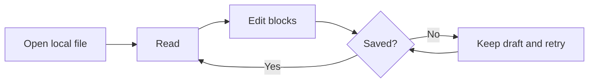

# A quiet place to think

A practical document for testing **open.md** without turning the test into noise.
It combines _reading rhythm_, `inline code`, ~~completed ideas~~, local media,
structured data, and editable tasks in one file.

> Good reading software should feel present when you need it and quiet when you
> do not. The document stays in charge; the chrome simply keeps your place.


_The image is local to this example, so it also exercises safe relative media
loading and meaningful alternative text._

## Reading checklist

- [x] A clear hierarchy
- [x] A comfortable line length
- [x] Local files stay local
- [ ] Review the unfinished task in Read mode
- [ ] Move the cursor through this line in Edit mode

## Lists with depth

- The reader keeps the artifact first.
  - Themes change the mood without changing the content.
  - Line guides and the minimap remain optional.
- The editor keeps changes visible.
  - Auto-save is on by default.
  - Undo and redo confirm their result with a toast.

1. Open the file.
2. Move through **Read**, **Edit**, and **Source**.
3. Resize the window until the table needs horizontal scrolling.
4. Return to this list without losing your place.

### Small formatting checks

Use **bold** for weight, _italic_ for voice, ~~strikethrough~~ for a finished
thought, and `Ctrl + Shift + E` for a compact keyboard token. A normal
[external link](https://github.com/) should remain recognizable and open through
the platform rather than replacing the document.

## What stays visible

| Moment | Primary signal | Secondary detail | Stress case |
| --- | --- | --- | --- |
| Opening | File name and type | Saved state | A deliberately long file name must not collide with window controls |
| Reading | Progress and place | Theme and zoom | Wide tables scroll inside their own frame |
| Editing | Active line and column | Minimap and guide | A long paragraph wraps without hiding the caret |
| Saving | Saved or unsaved | Retry feedback | Failed saves preserve the draft |

## A small diagram

The Mermaid block checks deferred diagram loading, theme synchronization, and
the transition from source text to a rendered graphic.



## Code and syntax

```javascript
const documentState = {
  mode: "read",
  local: true,
  autosave: true,
};

const nextMode = documentState.mode === "read" ? "edit" : "source";
console.log(`Next mode: ${nextMode}`);
```

Inline code such as `document.startViewTransition()` should remain compact,
while the fenced block above keeps its own scroll region and copy control.

## Notes and references

A footnote tests secondary reading material without making it compete with the
main flow.[^local-first] Unicode should remain intact too: café, naïve, 東京,
and a quiet em dash — all belong in a UTF-8 document.

[^local-first]: Local-first here means the document remains an ordinary Markdown
    file and local images are resolved only from safe paths beside it.

---

_The document is the interface._
