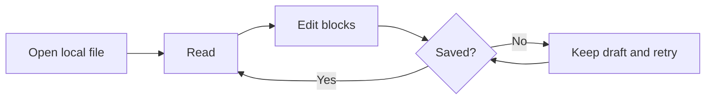
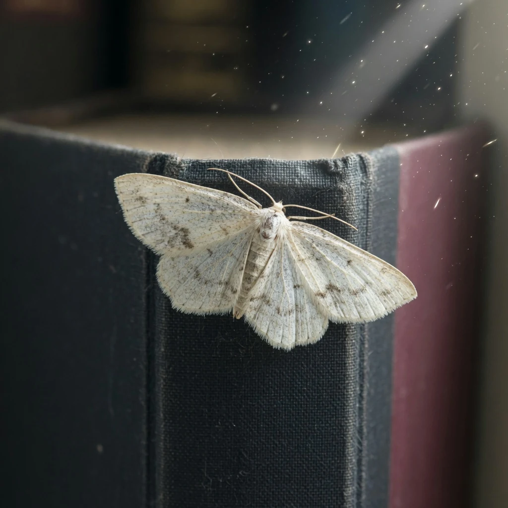
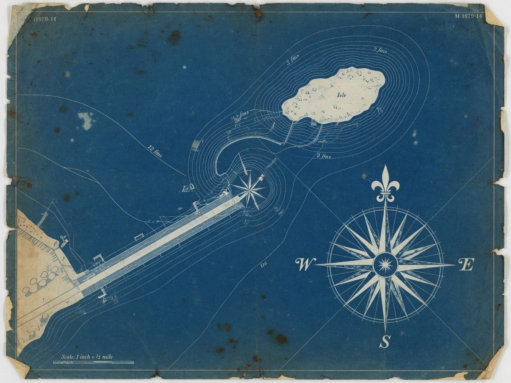
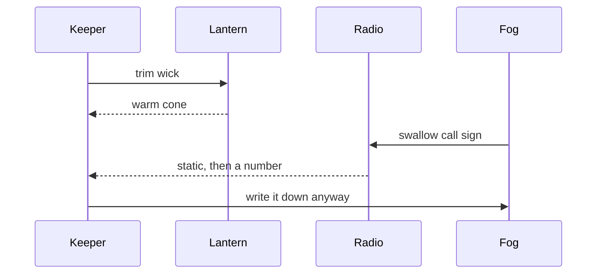
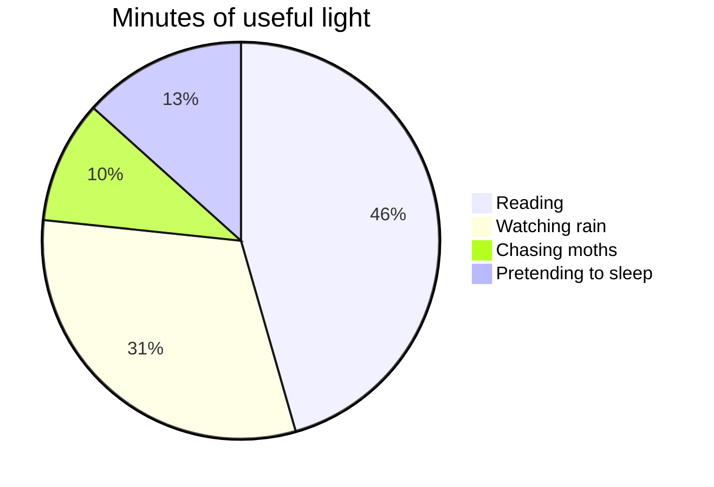

# A quiet place to think

A practical document for testing **open.md** without turning the test into noise.
It combines _reading rhythm_, `inline code`, ~~completed ideas~~, local media,
structured data, and editable tasks in one file.

> Good reading software should feel present when you need it and quiet when you
> do not. The document stays in charge; the chrome simply keeps your place.


_The image is local to this example, so it also exercises safe relative media
loading and meaningful alternative text._

## Reading checklist

- [x] A clear hierarchy
- [x] A comfortable line length
- [x] Local files stay local
- [ ] Review the unfinished task in Read mode
- [ ] Move the cursor through this line in Edit mode
- [ ] Open the companion files from the [harbor index](README.md)
- [ ] Confirm the lantern still burns in [the still life](assets/lantern.jpg)

## Lists with depth

- The reader keeps the artifact first.
  - Themes change the mood without changing the content.
  - Line guides and the minimap remain optional.
- The editor keeps changes visible.
  - Auto-save is on by default.
  - Undo and redo confirm their result with a toast.

1. Open the file.
2. Move through **Read**, **Edit**, and **Source**.
3. Resize the window until the table needs horizontal scrolling.
4. Return to this list without losing your place.
5. Follow a relative link to [telemetry](lumen-harbor.json) and come back.

### Small formatting checks

Use **bold** for weight, _italic_ for voice, ~~strikethrough~~ for a finished
thought, and `Ctrl + Shift + E` for a compact keyboard token. A normal
[external link](https://github.com/) should remain recognizable and open through
the platform rather than replacing the document.

## What stays visible

| Moment | Primary signal | Secondary detail | Stress case |
| --- | --- | --- | --- |
| Opening | File name and type | Saved state | A deliberately long file name must not collide with window controls |
| Reading | Progress and place | Theme and zoom | Wide tables scroll inside their own frame |
| Editing | Active line and column | Minimap and guide | A long paragraph wraps without hiding the caret |
| Saving | Saved or unsaved | Retry feedback | Failed saves preserve the draft |
| Companions | Format label | Keys, rows, or pixels | JSON trees, CSV tables, VGA NFO cells |

## A small diagram

The Mermaid block checks deferred diagram loading, theme synchronization, and
the transition from source text to a rendered graphic.



## Code and syntax

```javascript
const documentState = {
  mode: "read",
  local: true,
  autosave: true,
};

const nextMode = documentState.mode === "read" ? "edit" : "source";
console.log(`Next mode: ${nextMode}`);
```

Inline code such as `document.startViewTransition()` should remain compact,
while the fenced block above keeps its own scroll region and copy control.

## Notes and references

A footnote tests secondary reading material without making it compete with the
main flow.[^local-first] Unicode should remain intact too: café, naïve, 東京,
and a quiet em dash — all belong in a UTF-8 document.

[^local-first]: Local-first here means the document remains an ordinary Markdown
    file and local images are resolved only from safe paths beside it.

---

## Field notes from Lumen Harbor

The rest of this file is the keeper's working notebook. It is still a reading
test: more headings, more local pictures, more languages for the highlighter,
and enough prose that scrolling, the minimap, and search have something to do.


The pier takes the weather personally. Planks shine. Rope keeps its coil. A
cloth-bound notebook sits on a crate as if the harbor were a desk that learned
to float. Tonight the job is the same as every night: trim the wick, count the
moths, refuse the cloud.

### Watch standing orders

1. Light [lantern #4](assets/lantern.jpg) before the fog reaches the bollards.
2. Log the tide in [the CSV](tide-log.csv); do not invent centimetres.
3. If the radio coughs, read [radio.cfg](radio.cfg) before answering.
4. Program NFO lives in [lumen-station.nfo](lumen-station.nfo). Look, do not edit.
5. Leave the [empty chair](assets/rain-glass.avif) empty.

> The chrome is not the document. The lantern is not the weather. The moth on
> the book spine is not a bookmark, even when it sits very still.



#### Moth census, 23:40

- Ida — cream wings, ash speckle, patient.
- Percival — slightly drunk on kerosene halo.
- Little Noise — too small to count, counted anyway.
- Glass-Eater — photographs poorly, exists anyway.

##### Materials on the blotter

Pigments from the chart locker, used to retouch the cyanotype when salt
bleaches the shallows.


###### Chart locker



The compass rose is sincere. The place names are not. North is a rumour we
agreed to keep.

## Night sequence

Who talks to whom when the fog closes the channel.



Hours the lamp was actually useful:



## Syntax gallery

Fenced blocks below cover every language the reader currently highlights.
They are harbor-shaped so the sample is not a pile of `foo/bar`.

### TypeScript

```typescript
type Watch = "first" | "middle" | "last";

interface HarborNotice {
  readonly watch: Watch;
  moths: number;
  fogMeters: number;
  lampTrimmed: boolean;
}

export function nextNotice(current: HarborNotice): HarborNotice {
  const moths = Math.max(0, current.moths + (current.fogMeters > 40 ? 1 : 0));
  return { ...current, moths, lampTrimmed: true };
}

const standing: HarborNotice = {
  watch: "last",
  moths: 14,
  fogMeters: 62,
  lampTrimmed: false,
};

console.info("next", nextNotice(standing));
```

### Python

```python
from dataclasses import dataclass
from datetime import datetime, timezone


@dataclass
class Tide:
    at: datetime
    centimeters: int
    phase: str


def format_watch(tide: Tide) -> str:
    stamp = tide.at.astimezone(timezone.utc).strftime("%H:%M")
    return f"{stamp}  {tide.phase:<6}  {tide.centimeters:4d} cm"


if __name__ == "__main__":
    now = datetime.now(timezone.utc)
    print(format_watch(Tide(at=now, centimeters=184, phase="flood")))
```

### Rust

```rust
#[derive(Debug, Clone, Copy)]
pub struct Lamp {
    pub wick_mm: u8,
    pub fuel_ml: u16,
}

impl Lamp {
    pub fn trim(mut self, mm: u8) -> Self {
        self.wick_mm = mm.min(12);
        self
    }

    pub fn burn(&self, minutes: u16) -> u16 {
        self.fuel_ml.saturating_sub(minutes / 3)
    }
}

fn main() {
    let lamp = Lamp { wick_mm: 9, fuel_ml: 420 }.trim(7);
    println!("fuel left: {} ml", lamp.burn(47));
}
```

### SQL

```sql
SELECT
  watch_id,
  keeper_name,
  moth_count,
  fog_meters,
  lamp_trimmed_at
FROM harbor.watches
WHERE fog_meters >= 40
  AND lamp_trimmed_at IS NOT NULL
ORDER BY lamp_trimmed_at DESC
LIMIT 12;
```

### Bash

```bash
#!/usr/bin/env bash
set -euo pipefail

WATCH="${WATCH:-last}"
LOG="./overnight.log"

trim_lamp() {
  local wick="${1:-7}"
  printf 'trimmed wick to %s mm at %s\n' "$wick" "$(date -Iseconds)" >> "$LOG"
}

trim_lamp 7
rg -n "ERROR|WARN" "$LOG" || true
```

### CSS

```css
:root {
  --lamp: #e2b15a;
  --fog: color-mix(in oklab, #9eb6c4 62%, white);
}

.harbor-desk {
  max-width: 68ch;
  margin-inline: auto;
  color: CanvasText;
  background: Canvas;
}

.harbor-desk h1 {
  letter-spacing: -0.03em;
  text-wrap: balance;
}

@media (prefers-reduced-motion: reduce) {
  .lantern-flicker { animation: none; }
}
```

### XML

```xml
<?xml version="1.0" encoding="UTF-8"?>
<watch id="lh-23-47" xmlns="urn:lumen-harbor:watch">
  <keeper xml:lang="en">The unnamed night shift</keeper>
  <lamp fuel="kerosene" trimmed="true">4</lamp>
  <weather>
    <fog meters="62"/>
    <rain vertical="true"/>
  </weather>
  <note>The document is the interface.</note>
</watch>
```

### JSON

```json
{
  "station": "Lumen Harbor",
  "watch": "last",
  "lamp": { "id": 4, "trimmed": true },
  "moths": ["Ida", "Percival", "Little Noise", "Glass-Eater"],
  "cloud": false
}
```

### YAML

```yaml
station: Lumen Harbor
watches:
  last:
    keeper: unnamed
    moths: 14
    fog_m: 62
    notes: >
      Leave the chair empty.
      Count the moths twice.
```

### INI

```ini
[station]
name=Lumen Harbor
grid=80x25

[lamp]
id=4
fuel=kerosene
trimmed=true

; comments should stay comments
[radio]
channel=ch-4
call_sign=LH-00
```

### Properties / env

```properties
HARBOR_NAME=Lumen Harbor
HARBOR_CLOUD=false
HARBOR_LAMP_ID=4
HARBOR_WATCH=last
# the rain already knows
HARBOR_SECRET=not-a-real-secret
```

### Markdown inside Markdown

```markdown
# Nested sample

A fenced Markdown block should highlight headings, `code`, and
[links](a-quiet-place.md) without escaping into the parent document.
```

## Wide operational table

Resize until this table has to scroll on its own. Names are long on purpose.

| Watch | Keeper alias | Lamp | Wick mm | Fuel ml | Fog m | Moths | Tide cm | Radio | Chair | Note that should not collide with window chrome |
| --- | --- | --- | --- | --- | --- | --- | --- | --- | --- | --- |
| First | Glass-Eater's friend | #4 | 8 | 510 | 18 | 3 | 142 | clear | empty | Coffee still steaming |
| Middle | The unnamed | #4 | 7 | 420 | 41 | 9 | 168 | static | empty | Fog ate the call sign |
| Last | The unnamed still | #4 | 7 | 390 | 62 | 14 | 184 | number | empty | Wrote this sentence |
| Relief | Nobody came | #4 | 6 | 360 | 70 | 16 | 190 | hush | empty | Minimap optional |

## Companion map

Relative links should open inside the reader when the target is a supported
document. Images stay view-only.

- Notebook: [a-quiet-place.md](a-quiet-place.md)
- Station bible: [lumen-harbor.markdown](lumen-harbor.markdown)
- Letter: [night-watch.txt](night-watch.txt)
- Telemetry: [lumen-harbor.json](lumen-harbor.json)
- Watches: [lumen-harbor.yaml](lumen-harbor.yaml)
- Roster: [station-roster.yml](station-roster.yml)
- Cargo: [lumen-harbor.toml](lumen-harbor.toml)
- VGA settings: [station.ini](station.ini)
- Radio: [radio.cfg](radio.cfg)
- Daemon: [harbor.conf](harbor.conf)
- Env: [harbor.env](harbor.env)
- Tides: [tide-log.csv](tide-log.csv)
- Overnight: [overnight.log](overnight.log)
- Program NFO: [lumen-station.nfo](lumen-station.nfo)
- Kodi movie NFO: [kodi-the-quiet-place.nfo](kodi-the-quiet-place.nfo)
- Kodi show NFO: [kodi-harbor-nights.nfo](kodi-harbor-nights.nfo)
- Windows MsInfo NFO: [windows-msinfo.nfo](windows-msinfo.nfo)
- Animated lamp: [lantern.gif](assets/lantern.gif)

## Closing the watch

The unfinished tasks at the top stay unfinished so Read mode has a checkbox to
toggle. The finished ones stay finished so strikethrough and checked boxes both
have a job. The quiet place is still a desk, a window, and one notebook.[^chair]

[^chair]: The chair in `assets/rain-glass.avif` is a reflection. Do not sit
    down in the glass.

---

_The document is the interface._
