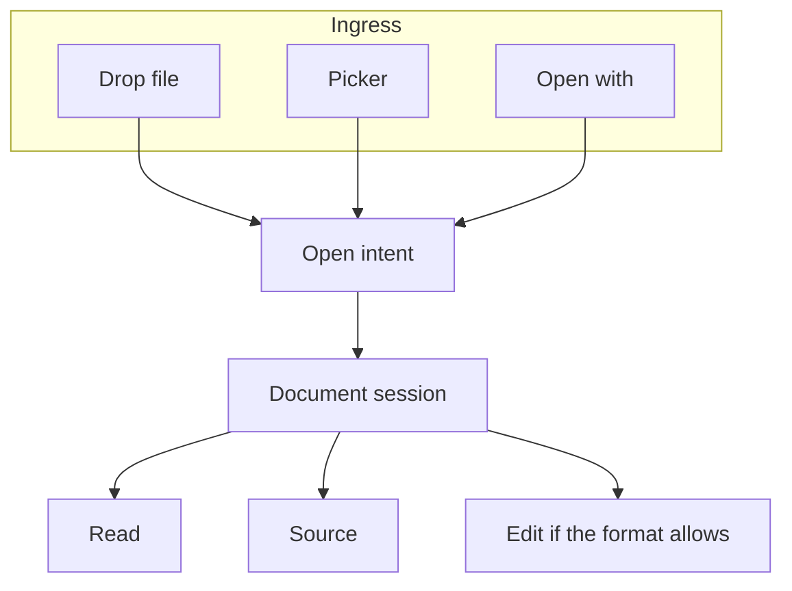
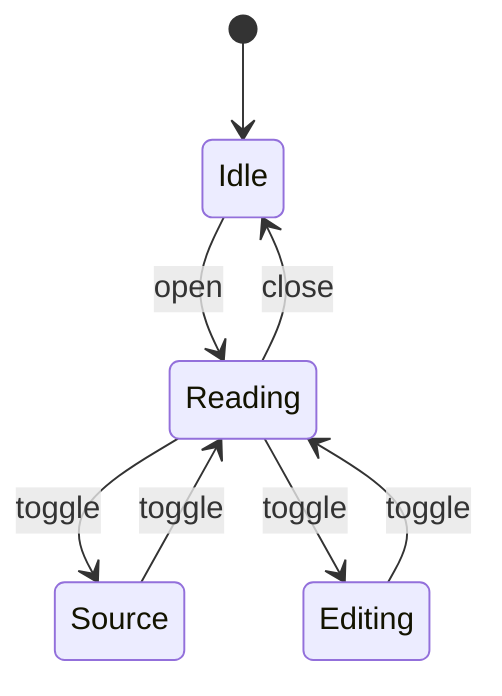

# Lumen Harbor station bible

This `.markdown` companion is the long-form operations document. It exists so
the reader can open a second Markdown extension, follow relative links from
[the quiet notebook](a-quiet-place.md), and stress syntax highlighting with
complete samples rather than `foo`.


> Standing order 0: if the lamp is out, nothing else in this file matters.

## Identity

| Field | Value |
| --- | --- |
| Station | Lumen Harbor |
| Grid | UTF-8 documents. Scene CP437 NFO stays in fixtures. |
| Watch | First / middle / last |
| Cloud | Forbidden |
| Editor for `.nfo` / `.log` | None. Read and Source only. |

The station is fictional. The formats are not.

## Contents

- [Watches](#watches)
- [Lamp](#lamp)
- [Radio](#radio)
- [Moths](#moths)
- [Documents](#documents)
- [Highlight corpus](#highlight-corpus)
- [Diagrams](#diagrams)

## Watches

- [x] First watch: coffee, wick, empty chair
- [x] Middle watch: fog, static, nine moths
- [ ] Last watch: this sentence, still unfinished
- [ ] Relief: nobody came

The last watch writes. The first watch reads what the last watch swore was
finished. It never is.

### Duty

1. Trim lantern **#4**.
2. Copy tide rows into [tide-log.csv](tide-log.csv).
3. If the daemon coughs, open [harbor.conf](harbor.conf).
4. If a stranger drops an `.nfo`, look at [lumen-station.nfo](lumen-station.nfo)
   before assuming it is Kodi XML. The XML cousins are
   [kodi-the-quiet-place.nfo](kodi-the-quiet-place.nfo) and
   [windows-msinfo.nfo](windows-msinfo.nfo).

## Lamp


Fuel is kerosene. The wick is trimmed to 7 mm. Flicker for the impatient is
recorded as [lantern.gif](assets/lantern.gif).

```ini
[lamp]
id=4
fuel=kerosene
wick_mm=7
fuel_ml=390
trimmed=true
halo=bored
```

## Radio

Call sign `LH-00`. Channel 4. The fog answers on 2182 when it feels like it.
Full scratch lives in [radio.cfg](radio.cfg).

```bash
#!/usr/bin/env bash
set -euo pipefail
printf 'CQ CQ DE LH-00  fog %s m  moths %s\n' "${FOG_M:-62}" "${MOTHS:-14}"
```

## Moths


They are unionized. They are not bookmarks. Census rows:

| Name | Wings | Vice | Counted |
| --- | --- | --- | --- |
| Ida | cream, ash speckle | patience | yes |
| Percival | slightly drunk | kerosene | yes |
| Little Noise | too small | existing | yes |
| Glass-Eater | photographs poorly | glass | yes |

## Documents

Telemetry, roster, cargo, overnight whisper:

- [lumen-harbor.json](lumen-harbor.json)
- [lumen-harbor.yaml](lumen-harbor.yaml)
- [station-roster.yml](station-roster.yml)
- [lumen-harbor.toml](lumen-harbor.toml)
- [overnight.log](overnight.log)
- [night-watch.txt](night-watch.txt)

Windows System Information also wears `.nfo`. Ours is
[windows-msinfo.nfo](windows-msinfo.nfo) and must open as ordinary text, not as
a scene grid. The Unicode program readme is [lumen-station.nfo](lumen-station.nfo).

## Highlight corpus

Every language registered in the reader, written as something the harbor would
actually keep.

### JavaScript

```javascript
const station = Object.freeze({
  name: "Lumen Harbor",
  cloud: false,
  lamp: { id: 4, trimmed: true },
});

function describe(watch) {
  const moths = watch.moths ?? 0;
  return `${station.name} / ${watch.id} / moths=${moths}`;
}

export function startWatch(id = "last") {
  const watch = { id, moths: 14, fogMeters: 62 };
  console.log(describe(watch));
  return watch;
}

startWatch();
```

### TypeScript

```typescript
export type Fog = { meters: number; swallowsCallSign: boolean };

export async function standWatch(fog: Fog): Promise<string> {
  if (fog.meters > 50 && fog.swallowsCallSign) {
    return "write the number anyway";
  }
  return "channel clear";
}

void standWatch({ meters: 62, swallowsCallSign: true }).then((line) => {
  console.log(line);
});
```

### Python

```python
from pathlib import Path

STATION = Path(__file__).resolve().parent


def iter_logs(root: Path = STATION):
    for path in sorted(root.glob("*.log")):
        yield path.name, path.read_text(encoding="utf-8").count("\n")


if __name__ == "__main__":
    for name, lines in iter_logs():
        print(f"{name:20} {lines:4d} lines")
```

### Rust

```rust
use std::time::Duration;

pub struct FogBank {
    pub meters: u16,
}

impl FogBank {
    pub fn swallows_radio(&self) -> bool {
        self.meters >= 40
    }
}

pub fn retry_delay(fog: &FogBank) -> Duration {
    if fog.swallows_radio() {
        Duration::from_secs(11)
    } else {
        Duration::from_secs(3)
    }
}
```

### SQL

```sql
WITH last_watch AS (
  SELECT keeper_id, moth_count, fog_meters
  FROM harbor.watches
  WHERE ended_at IS NULL
)
UPDATE harbor.lamps
SET wick_mm = 7, trimmed_at = CURRENT_TIMESTAMP
WHERE lamp_id = 4
  AND EXISTS (SELECT 1 FROM last_watch WHERE fog_meters >= 40);
```

### CSS

```css
.nfo-grid {
  font-family: "IBM VGA 8x16", ui-monospace, monospace;
  line-height: 1;
  white-space: pre;
  font-variant-ligatures: none;
}

.nfo-grid :focus-visible {
  outline: 2px solid var(--lamp, #e2b15a);
  outline-offset: 2px;
}
```

### XML

```xml
<?xml version="1.0" encoding="UTF-8"?>
<station name="Lumen Harbor">
  <lamp id="4" fuel="kerosene"/>
  <moths>
    <moth name="Ida"/>
    <moth name="Percival"/>
  </moths>
</station>
```

### JSON

```json
{
  "ok": true,
  "station": "Lumen Harbor",
  "warnings": ["fog", "moths", "unread letters"],
  "counts": { "moths": 14, "letters": 14, "chairs": 1 }
}
```

### YAML

```yaml
# harbor-shaped, not lorem
station: &station
  name: Lumen Harbor
  cloud: false

watch:
  <<: *station
  id: last
  moths:
    - Ida
    - Percival
```

### INI / TOML-shaped

```ini
[harbor]
name=Lumen Harbor
cloud=false

[limits]
nfo_columns=80
log_edit=false
```

### Markdown

```markdown
## Nested heading

- [ ] a task inside a fence
- [x] still a fence

`inline` and a [link](README.md).
```

### Properties

```properties
harbor.station=Lumen Harbor
harbor.cloud=false
harbor.lamp.id=4
# last watch
harbor.watch=last
```

## Diagrams





## Closing

The bible is allowed to ramble. The notebook at
[a-quiet-place.md](a-quiet-place.md) stays the short reading test with the
required quiet-desk picture. This file is the extra weight: two Markdown
extensions, many fences, and a harbor that does not exist.

Café, naïve, 東京, π, and an em dash — all still belong here.

[^bible]: A bible, in station slang, is the document nobody updates and
    everybody quotes.

---

_The document is the interface._
